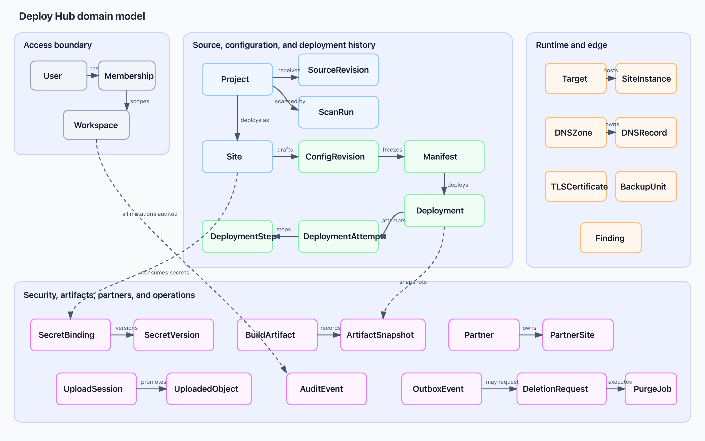
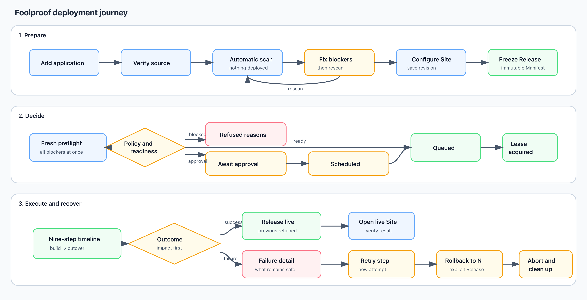
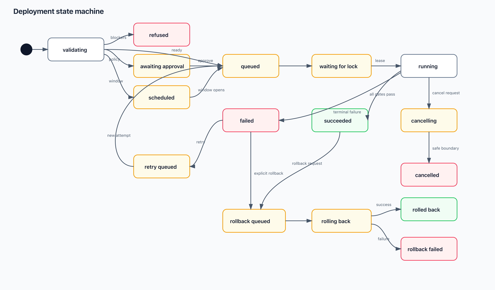
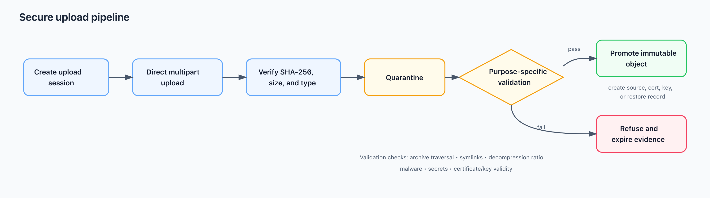
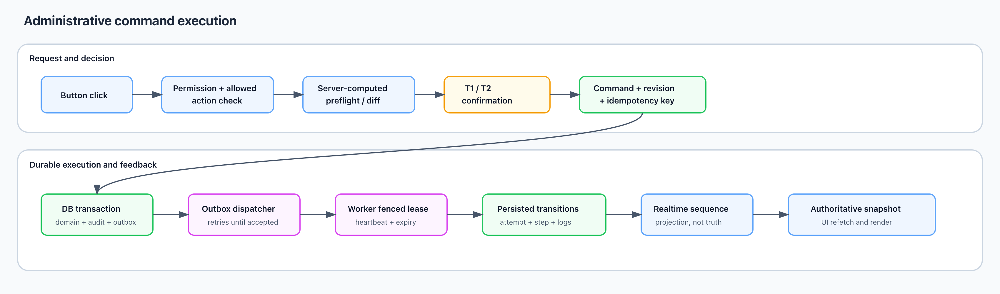

# Deploy Hub Admin Panel and Foolproof Deployment Experience

**Status:** Product, UX, UI, and platform architecture plan  
**Date:** 2026-08-27  
**Scope:** Backend administration and operator-console planning; no frontend implementation. Visual concepts are provided separately.

**Functional visual companion:** [Design Concepts — Functional Screen Contract](design-concepts/functional-screen-contract.md)

**Visual fidelity companion:** [HUD Style Fidelity Specification](design-concepts/hud-style-fidelity-spec.md)

**Production delivery companion:** [HUD Production Implementation Plan](design-concepts/production-implementation-plan.md)

## Executive summary

Deploy Hub should have two related but distinct workspaces:

1. The existing **operator console** for routine deployment, monitoring, and incident recovery.
2. A role-gated **Administration workspace** for fleet configuration, access control, integrations, secrets, retention, decommissioning, and audit.

Both workspaces must use the same Project, Site, Target, Deployment, Finding, Partner, and Vault records. The Administration workspace must not become a generic database editor, and Django's `/admin` should remain a restricted break-glass/debug surface.

The repository already contains strong foundations:

- `Project` separates source code from `Site`, which represents one deployable configuration/domain.
- `Manifest` is immutable and versioned.
- `Deployment` and `DeploymentStep` persist deployment progress.
- Desired and observed instance state are separate.
- Postgres operation locks and deployment heartbeats exist.
- Secrets are envelope-encrypted and values are write-only.
- Findings, backups, DNS, TLS, target metrics, and audit events are modeled.
- T1/T2/T3 action tiers define interaction friction.
- WebAuthn provides hardware step-up for critical operations.
- The frontend has a shared realtime connection state and snapshot-then-stream behavior.

The largest gaps are operational rather than conceptual:

- There is no normal deployment create/list/detail/cancel/retry API, and the Deployments screen is permanently empty.
- Project and Site editing is incomplete; Site PATCH currently edits only `edge_owner`.
- Scanning is still presented as a CLI workflow.
- A new deployment can silently supersede a running deployment while its worker may still be active.
- Rollback does not select an explicit prior release and may redeploy the release that is already live.
- The API has authentication but no complete Viewer/Operator/Deployer/Admin/Owner authorization model.
- Physical cascade deletion can erase operational history.
- There is no usable Vault, audit-event, membership, operation-lock, DNS-zone, or system-administration UI.

The recommended implementation order is to make the system trustworthy before making it powerful: build read-only administration and RBAC first, then versioned configuration, reliable deployment commands, safe rollback, secrets/artifacts, uploads, and finally archive/decommission/purge workflows.

---

## 1. Product vocabulary

The product must use the following terms consistently:

- **Project:** Source code, represented by a Git repository or a controlled server-local path.
- **Site:** One deployed configuration/environment of a Project, such as production, staging, preview, or development.
- **Configuration revision:** An editable, versioned draft of the desired Site configuration.
- **Release:** An immutable Manifest created from a source revision, scan, and configuration revision.
- **Deployment:** One request to make a Release live.
- **Deployment attempt:** One execution attempt, including retries.
- **Target:** A managed host on which Sites run.
- **Site instance:** One running copy of a Site on one Target.
- **Finding:** A durable item requiring attention, acknowledgement, remediation, or accepted risk.
- **Operation:** A long-running administrative command such as scan, deploy, restore, rotate, drain, or purge.

The interface should explain once, near the Project/Site surfaces:

> A Project is source code. A Site is one deployed environment, domain, and configuration of that source.

## 2. Domain relationship map



`Finding` and Vault ownership relationships may remain logical rather than database foreign keys, but every lookup and mutation must be scoped to a Workspace and checked by an authorization service.

---

## 3. Workspace and navigation structure

### 3.1 Operator console

Preserve the current six-item, object-centric navigation:

1. Home
2. Sites
3. Targets
4. Deploys
5. Findings
6. Settings

The operator console is for frequent operational work: deploy, observe, diagnose, retry, recover, acknowledge, and inspect.

### 3.2 Administration workspace

Add an **Administration** entry to the authenticated user's menu. Show it only to authorized administrators. Its sidebar should be:

1. Overview
2. Projects
3. Sites
4. Deployments
5. Targets
6. Operations
7. Partners
8. Access & Secrets
9. Audit & System

Admin mode should reveal privileged tabs and commands on the same underlying objects. It must not create duplicate Project, Site, or Deployment pages with conflicting behavior.

### 3.3 Global shell

Every administration page should display:

- Breadcrumbs.
- Global search across project name, site/domain, target host, deployment ID, finding fingerprint, and partner.
- A persistent Production/Test environment badge.
- Realtime connection state, including `data as of` when degraded.
- Open P1/P2 count.
- Current user and role.
- Notifications/activity drawer for completed, failed, or refused asynchronous operations.
- One primary action per page.
- User menu with Security, Administration, and Sign out.

---

## 4. Button and interaction contract

The action tier is the single source of truth for interaction friction, but authorization must be enforced separately.

| Control | Appearance and behavior | Reason |
|---|---|---|
| Primary action | Solid, text-labelled, one per page or panel | Makes the safest next step obvious |
| Secondary action | Neutral bordered button | Keeps alternatives visible without competing with the main task |
| Navigation action | Text link or subtle neutral control | Prevents navigation from looking like a mutation |
| Destructive action | Red outline and explicit destructive verb | Reduces accidental activation and ambiguity |
| T1 critical action | Type exact object name plus recent WebAuthn hardware touch | Protects destructive, security-sensitive, or cost-bearing operations |
| T2 disruptive action | Confirmation dialog with exact before → after diff | Makes users confirm consequences, not a vague verb |
| T3 recovery action | Immediate action only when safe, idempotent, and truly undoable | Keeps incident recovery fast without dishonest undo behavior |
| Disabled action | Dimmed but visible, with reason beside or below it | Explains why the action is unavailable on mouse, touch, and assistive technology |
| Busy action | Keeps original label, adds spinner and `aria-busy`, prevents duplicate requests | Preserves orientation and provides idempotent behavior |
| Row overflow | Text-labelled `More actions`; destructive items separated | Keeps dense tables safe and scannable |
| Copy action | Changes to `Copied ✓`, with manual-copy fallback | Provides immediate, accessible feedback |
| Download action | Names the artifact and format | Prevents downloading the wrong file |
| Save action | Enabled only when dirty; accompanied by `Discard` | Prevents silent or accidental edits |

### 4.1 Tier rules

- **Read-only:** No confirmation.
- **T3 recovery:** One click only if the inverse operation is real. Otherwise use T2.
- **T2 disruptive but reversible:** Show the server-computed impact and diff.
- **T1 destructive/security/cost:** Require authorization, typed name, recent hardware touch, and a server-computed impact plan.

Rollback should be treated as T2 until the backend implements a truthful inverse or undo. A visual undo timer without a backend inverse is not acceptable.

### 4.2 Required UI states

Every page, table, card, panel, and form must define:

- Initial loading.
- Background refreshing without blanking current data.
- Empty collection with one sentence and one next action.
- No filter matches with `Clear filters`.
- Full error with safe server message and `Retry`.
- Partial error isolated to the failed region.
- Offline/degraded with stale content and `data as of`.
- Session expired with mutations disabled and `Reload and log in`.
- Permission denied with required role explained.
- Not found/deleted with a collection link.
- `409 Conflict` with current server data and a field-level conflict explanation.
- Accepted asynchronous operation with an operation/deployment/check ID.
- Concise success announcement and authoritative data refresh.
- Refused destructive action that retains user input and lists every refusal reason.

---

## 5. Administration Overview

### Displays

- Open P1/P2 findings.
- Running, queued, waiting-for-lock, and failed deployments.
- Healthy, warming, unhealthy, and stale Sites.
- Ready, pressured, unreachable, and decommissioned Targets.
- Never-scanned Projects.
- Stale configuration and manifests.
- Expiring TLS certificates.
- Sites without valid backup coverage.
- Failed backups and overdue restore drills.
- Stale operation locks.
- AWS, Cloudflare, Origin CA, Vault, partner intake, audit shipping, and notifications health.
- First-run checklist until the Hub is operational.

Every metric must name its scope, for example `3 blocked sites`, not merely `3 blockers`.

### Buttons

- **Add application:** Opens the Project + first Site wizard.
- **Review blockers:** Opens Findings filtered to deployment blockers.
- **View running deployments:** Opens Deployments filtered to queued/running/waiting states.
- **Finish setup:** Opens the first incomplete setup task.
- **Retry:** Reloads only the failed dashboard region.

No dashboard card should mutate fleet state directly.

---

## 6. Projects

### 6.1 Project list

Display columns:

- Name and slug.
- Source kind.
- Git URL/ref or controlled local path.
- Latest source revision.
- Scan state and scanned-at time.
- Blocker, warning, advice, deferred, and OK counts.
- Number of Sites.
- Release freshness across Sites.
- Latest deployment result.
- Created by and created at.

Filters:

- Scanned/not scanned.
- Has blockers.
- Manifest current/stale/missing.
- Source kind.
- Has production Sites.
- Creator.
- Active/archived.

Buttons:

- **Open:** Project detail.
- **Scan now:** Enqueues a diagnostic scan; no source execution on the Hub.
- **Configure site:** Opens the server-driven Site wizard.
- **Add site:** Creates another environment for the Project.
- **Edit source:** T2 with old → new source and affected Sites.
- **Archive project:** Reversible; disables normal automation and hides it from default views.
- **Delete permanently:** Normally absent; only possible after every Site is purged and retention expires.

### 6.2 Add application wizard

#### Step 1 — Source

Display:

- Project name.
- Source type: Git repository by default; server-local path only in developer mode.
- Git URL.
- Branch/tag.
- Repository credential selection.
- Connection status and detected refs.

Buttons:

- **Test source:** Read-only repository access verification.
- **Continue:** Enabled after valid source selection.
- **Save draft:** Preserves incomplete setup.
- **Cancel:** Discards only the draft.

#### Step 2 — First Site

Display:

- Site name.
- Environment kind: production, staging, preview, or development.
- Public or mesh-only exposure.
- Domain.
- Cloudflare proxy state.

#### Step 3 — Placement and policy

Display:

- DNS zone.
- Primary Target.
- Blue-green or recreate deployment.
- Automatic, approval-required, or windowed policy.
- Deployment window when applicable.

#### Step 4 — Review

Display a server-generated summary:

> This creates one Project and one Site. Nothing will be deployed.

Buttons:

- **Back**
- **Create application**
- **Cancel**

### 6.3 Project detail

Tabs:

- Overview
- Readiness
- Sites
- Source
- Activity

Readiness must show:

- Exact scan timestamp.
- Modules that actually ran.
- Total checks and OK count.
- Blockers, warnings, advice, and deferred checks.
- Expandable evidence and fix hints.
- Explicit `Never scanned` versus `Clean` state.
- Differences from the scan used by the current release.

Add immutable `ScanRun` history. Overwriting `Project.scan_report` prevents trustworthy comparison between scans.

---

## 7. Sites

### 7.1 Site list

Display columns:

- Site name, environment, and Project.
- Domain and exposure.
- Owner: internal or partner.
- Serving health.
- Live release → desired release.
- Primary Target and running copy count.
- Active deployment/current step.
- Deployment policy and next window.
- TLS state and expiry.
- Backup recency.
- Highest open Finding.
- Last deployment time and actor.

Filters:

- Project.
- Environment.
- Mine/partner.
- Public/mesh-only.
- Healthy/warming/unhealthy/stale.
- Manifest current/stale/missing.
- Target.
- Deployment status.
- TLS warning.
- Open Findings.
- Preview/production.

Each row has one contextual primary action:

- **Finish setup**
- **Fix blockers**
- **Review release**
- **Approve update**
- **View deployment**
- **Deploy**

Row overflow actions:

- Edit configuration.
- Rescan source.
- Clone as another environment.
- Create preview.
- Pause/resume automation.
- Archive.

Destructive Site removal must remain inside Site detail.

### 7.2 Site header

Display:

- Site, Project, environment, domain, and ownership.
- Current health.
- Live and desired releases.
- Primary Target.
- Latest observation timestamp.
- Active deployment.
- Highest Finding.

Buttons:

- **Open live site**
- **Deploy latest release**
- **Roll back to release N**
- **More actions**

### 7.3 Overview tab

Display:

- Desired and observed state.
- Site Instances and Targets.
- Latest deployment and impact headline.
- Source revision and manifest freshness.
- DNS/TLS state.
- Backup state.
- Traffic and uptime summary.
- Attack-playbook state.
- Reconciliation freshness.
- Open Findings.

Buttons:

- View deployment.
- View logs.
- View Finding.
- Reconcile now.
- Restart Instance, once implemented.
- Open topology.

### 7.4 Configuration tab

Editable fields:

- Name.
- Domain.
- Environment kind.
- Exposure.
- Proxied state.
- Primary Target.
- Deployment strategy.
- Deployment policy.
- Deployment window.
- Maintenance-until.
- Reconciliation enabled.
- Liveness path.
- Readiness path.
- Warm-up timeout.
- DNS zone.
- Edge owner.

`scale_ready` should be displayed as a derived readiness result unless it becomes a genuine operator-controlled declaration with validation.

Buttons:

- **Edit**
- **Save changes:** T2 with field-by-field diff and optimistic revision check.
- **Discard**
- **Configure from scan**
- **Review new release**

Editing creates a new `ConfigRevision` and marks the current release stale. It never edits an existing Manifest.

### 7.5 Environment & Secrets tab

Display only:

- Variable name.
- Set/not set.
- Active secret version.
- Last changed.
- Last used.
- Dependent Sites/releases.
- Configuration stale state.

Buttons:

- **Add variable**
- **Replace value**
- **Remove variable:** T2 with dependency check.
- **Import `.env`**
- **Apply environment:** T2, with the resulting Deployment named.
- **Discard staged import**

A secret input should be blank and say `Set` or `Not set`; it must not display fake mask characters as if they were the saved value.

### 7.6 Releases & Manifests tab

Display:

- Manifest version.
- Source commit/digest.
- Schema version.
- Scan hash and scan timestamp.
- Configuration revision.
- Creator and creation time.
- Warnings acknowledged.
- Linked Deployments.
- Current/live/previous labels.

Buttons:

- **View manifest**
- **Compare versions**
- **Download redacted JSON**
- **Deploy this release:** T2.
- **Roll back to this release:** T2 until truthful undo exists.

Never provide Edit, Delete, or Upload Manifest actions.

### 7.7 Instances & Networking tab

Display:

- Target.
- Desired and observed Instance state.
- Image digest/tag.
- Internal port.
- Observed/reconciled timestamps.
- Consecutive failures.
- Desired versus observed DNS values.
- TLS mode, fingerprint, push time, and expiry.

Buttons:

- **Change DNS:** T2 with record diff.
- **Move primary Target:** T2.
- **Deploy overflow copy:** T1.
- **Join overflow traffic:** T1.
- **Scale in overflow:** T1.
- **Probe health**
- **View Target**

### 7.8 Backups tab

Display:

- Backup-unit kind.
- Schedule.
- Latest dump time.
- Bytes.
- Digest prefix.
- Verification state.
- Restore-drill status.
- Restore command.

Buttons:

- **Test backup now:** T2.
- **Restore into clean container:** T1 with exact Site name and hardware touch.
- **Download metadata**
- **Copy restore command**

Never provide direct production overwrite.

### 7.9 Adoption tab

Display:

- Edge owner.
- Current stage.
- Temporary hostname.
- Classified web, worker, scheduler, migration, database, cache, and edge services.
- Registered volumes.
- Origin-CA readiness.
- Explicit live compose path.

Buttons:

- **Start adopt:** T2 with domain flip, decommission, and volume summary.
- **Cancel adopt:** Only before production flip.
- **Retry failed stage:** Only after retry semantics exist.
- **Roll back:** Once the production flip begins.

### 7.10 Activity tab

Display immutable, filtered history:

- Audit events.
- Check runs.
- Configuration revisions.
- Manifests.
- Deployments and attempts.
- Secret rotations.
- DNS/TLS operations.

### 7.11 Site removal

Use distinct commands:

- **Take down partner Site:** T2; changes the route to 410 and retains history.
- **Decommission Site:** T1; drains traffic, disables reconcile, stops Instances, and preserves records.
- **Delete preview:** T2 only for dependency-free previews.
- **Purge Site permanently:** Owner-only asynchronous deletion plan after retention.

Raw cascade deletion must not be exposed.

---

## 8. Deployment workflow

### 8.1 End-to-end journey



### 8.2 Scan

Creation should enqueue an automatic scan and navigate to progress.

Display:

- Source revision/commit.
- Queued → reading source → detecting framework → running checks → complete/failed.
- Modules that ran.
- Scan timestamp.
- Blockers, warnings, advice, and deferred checks.
- A persistent statement: `Nothing has been deployed.`

Buttons:

- **Rescan**
- **Retry scan** after infrastructure failure.
- **Configure Site** when no hard blockers remain.
- **Copy fix details**
- **View source revision**

Blockers are never overridable. Warnings require acknowledgement when creating the Release.

### 8.3 Configure release

Present the existing wizard as **Configure release**, not `Configure & materialize`.

Display sections:

- Routing.
- Runtime and framework detection.
- Deployment and placement.
- Environment variables.
- Data safety, volumes, migrations, and backups.
- Readiness and warnings.

Buttons:

- **Save changes**
- **Reset unsaved changes**
- **Review release**
- **Close**

Disable Review release while unsaved changes exist. This prevents users from typing values and accidentally freezing a Release that does not contain them.

### 8.4 Review and freeze release

Display a server-generated diff against the currently live successful Release:

- Current → proposed Release.
- Source revision.
- Manifest version.
- Scan timestamp.
- Configuration keys changed, without values.
- Domain/DNS/TLS changes.
- Target and strategy.
- Expected downtime.
- Migrations and backup freshness.
- Warnings.
- Fresh preflight blockers.

Buttons:

- **Back to configuration**
- **Create release**
- **Acknowledge warnings and create release**
- After success: **Deploy release N now**, **Schedule**, or **Done**

### 8.5 Deployment preflight

Before showing the confirmation, verify:

- Source immutability and availability.
- Current scan and manifest schema.
- Required secrets.
- Target readiness and capacity.
- No conflicting active lease.
- DNS/TLS access and domain uniqueness.
- Health/readiness configuration.
- Backup freshness before migrations.
- Deployment policy and window.
- Rollback candidate and migration compatibility.

Display:

- Ready or every blocking reason.
- Live Release → proposed Release.
- Target/domain.
- Strategy and estimated impact.
- Migration and backup state.
- Trigger and actor.

Buttons:

- **Deploy now:** T2 with exact diff and idempotency key.
- **Schedule for next window**
- **Approve pending Release**
- **Cancel**
- **View active Deployment** when another deployment owns the lease.

An admin-only **Replace active Deployment** must request cancellation, wait for lease surrender, and then start the successor. It must never silently release the old worker's lock.

### 8.6 Deployment list

Display columns:

- Deployment ID.
- Project/Site/environment.
- Release and source revision.
- Trigger and actor.
- Target snapshot.
- Status.
- Current/failed step.
- Impact headline.
- Queue/start/finish timestamps.
- Duration.
- Last heartbeat.
- Rollback relationship.

Filters:

- Active.
- Needs attention.
- Status.
- Project/Site.
- Target.
- Trigger/actor.
- Failed step.
- Date range.
- Rollbacks only.

Buttons:

- **Open**
- **View Site**
- **Cancel** when allowed.
- **Retry from failed step**
- **Roll back**
- **Download logs**

Never provide Delete Deployment.

### 8.7 Deployment detail

The header must answer:

1. What is affected?
2. What is serving now?
3. What is happening now?
4. How long has it been happening?
5. What is the safest next action?

Display:

- Site, environment, domain, Release, source revision, and Target.
- Overall state using symbol and word.
- Impact banner such as `Old version still serving` or `Site may be unreachable`.
- Start time, elapsed time, heartbeat, actor, trigger, and policy.
- Nine-step vertical timeline:
  1. Build
  2. Ship
  3. Migrate
  4. Start green
  5. Health check
  6. DNS
  7. Route & TLS
  8. Smoke test
  9. Cutover
- Per-step state, timestamps, duration, outcome, logs, and artifacts.
- Previous safe Release.
- Related Findings and audit events.
- Realtime/degraded freshness.

Buttons:

- **Open live Site**
- **Cancel queued Deployment**
- **Abort and clean up**
- **Retry from failed step**
- **Roll back to Release N**
- **Open Manifest**
- **Download all logs**
- **Copy Deployment ID**

### 8.8 Deployment state machine



Step states should be:

- pending
- blocked
- running
- succeeded
- failed
- skipped
- cancelling
- cancelled

### 8.9 Failure and recovery

Failure presentation order:

1. User impact.
2. Failed step and plain-language cause.
3. What remains safe/live.
4. Recommended recovery.
5. Technical logs and artifacts.

Show at most three primary recovery actions:

- **Retry from failed step:** Creates a new attempt and explains which successful steps will not repeat.
- **Roll back to Release N:** Names a distinct prior successful Release.
- **Abort and clean up:** Stops temporary green resources while preserving history and volumes.

Rollback must be asynchronous and must never infer `latest succeeded` as the desired rollback target.

---

## 9. Targets

### 9.1 Target list

Display columns:

- Host.
- Kind: SSH or AWS EC2.
- Zone and purpose.
- Lifecycle.
- Status.
- Provider reference.
- Last collection.
- Hosted Site count.
- CPU, RAM, disk, load.
- Open hardening/router Findings.

Filters:

- Status.
- Kind.
- Zone.
- Lifecycle.
- Unhealthy workloads.
- Findings.
- Collection stale.

Buttons:

- **Copy provision command** when AWS is unavailable.
- **Create Target:** T1 with cost estimate.
- **Retry cost** when pricing is unavailable.
- **Open**
- **Probe router**
- **Rotate SSH key**
- **Decommission Target**

### 9.2 Target detail

Tabs:

- Overview
- Workloads
- Metrics
- Hardening
- Router
- Keys
- Activity

Display:

- Host, kind, zone, purpose, lifecycle, status, and provider reference.
- SSH user and host-key fingerprint.
- Collection freshness.
- Workloads and internal ports.
- Metrics and capacity.
- Router advice.
- Hardening findings.
- SSH key metadata.
- Audit history.

Buttons:

- **Test connection**
- **Collect now**
- **Probe router**
- **Enter maintenance:** T2.
- **Drain workloads:** T2.
- **Rotate SSH key:** T1.
- **Terminate cloud Target:** T1.
- **Decommission Target:** T1.
- **View Finding**

Target removal workflow:

1. Stop scheduling new work.
2. Drain, migrate, or stop desired Site Instances.
3. Verify zero desired workloads and zero active locks.
4. Terminate the cloud resource when applicable.
5. Mark the Target decommissioned.
6. Preserve a tombstone and historical references.

---

## 10. Findings and Operations

### 10.1 Findings

Display columns:

- Severity symbol and word.
- State.
- Title.
- Entity.
- Source engine.
- First seen.
- Last seen.
- Age.
- Accepted-risk reason, owner, and expiry.

Filters:

- Severity.
- State.
- Entity.
- Source engine.
- Date/age.
- Accepted/unresolved.
- Saved views such as `Open P1/P2` and `Accepted risk`.

Buttons:

- **Open**
- **Ack**
- **Resolve**
- **Accept risk**
- **Re-run related check** when a concrete engine exists.
- **View entity**

Accept risk requires a reason, owner, and review expiry. Never allow bulk accept risk or Delete Finding.

### 10.2 Operations

Display subsections:

- Check runs.
- Backup and restore drills.
- Scheduled work.
- Operation locks.
- Upload sessions.
- Decommission/purge jobs.

Buttons:

- **Run now:** T2 for drills and backups.
- **Open result**
- **Retry**
- **View affected object**
- **Release stale lock:** T1, only after server-side stale-lock assessment.

---

## 11. Partners

### Partner list

Display:

- Slug/name.
- Active/suspended.
- Site count versus quota.
- Deploys/day quota.
- Domain quota.
- Destination order.
- Webhook state.
- Intake state.
- Creation time.

Buttons:

- **Create Partner:** T1.
- **Open**
- **Suspend Partner:** T1.
- **Enable/disable Partner API:** T1 command, never a switch.
- **View Sites**

### Partner detail

Tabs:

- Overview
- Sites
- Destinations
- Credentials
- Intake/Webhooks
- Activity

Destination controls:

- **Up**
- **Down**
- **Remove**
- Target selector.
- **Add destination**
- **Save destination order:** T2 with the final order and own-server reputation warning when an SSH Target is included.

Credential controls:

- **Rotate credentials**
- **Copy** newly minted credentials.
- **I saved them**

Credentials are shown once. There is no later Reveal action.

---

## 12. Access, roles, and sessions

Authentication friction does not replace authorization. Add Workspace-scoped membership and capabilities.

| Role | Read | Configure | Deploy | Approve production | Secrets | Members | Destructive |
|---|---|---|---|---|---|---|---|
| Viewer | Yes | No | No | No | Names only | No | No |
| Auditor | Yes + export | No | No | No | Metadata/audit | No | No |
| Operator | Yes | Runtime recovery | Retry/cancel/rollback by policy | No | Names only | No | No |
| Deployer | Yes | Project/Site drafts | Request deploy | No or policy-limited | Create versions | No | Archive non-production |
| Admin | Yes | Yes | Yes | Yes | Manage/rotate | Invite/change roles except Owner | Decommission |
| Owner | Yes | Yes | Yes | Yes | Full metadata | All | Purge/workspace deletion |

Optional production separation of duties should prevent a requester from approving their own Deployment.

### User table

Display:

- Username/email.
- Role.
- Active/disabled.
- Passkey count.
- TOTP fallback enrolled.
- Recovery-code count.
- Last login.
- Active sessions.
- Created time.

Buttons:

- **Invite/create user**
- **Change role:** T2.
- **Disable user:** T1.
- **Revoke sessions:** T1.
- **Require security re-enrollment:** T1.
- **Delete user:** T1 and unavailable for the last Owner.

### Security controls

- **Add passkey**
- **Rename passkey**
- **Remove passkey:** T1 and blocked if two-passkey requirements would be violated.
- **Enroll TOTP**
- **Confirm TOTP**
- **Regenerate recovery codes:** T1.
- **Revoke session**

Backend permissions must protect every endpoint and queryset. Hiding a button is not authorization.

---

## 13. Integrations, DNS, and Vault

### AWS

Display:

- Connected/not connected.
- Account last four.
- Region.
- Last verified time.
- IAM-scope status.
- Budget/cost configuration status.

Buttons:

- **Connect**
- **Verify again**
- **Replace credentials**
- **Disconnect:** T1.

### Cloudflare

Display:

- Account label.
- DNS zone and purpose.
- Token-scope verification.
- Proxy default.
- Origin-CA plant state.

Buttons:

- **Connect**
- **Verify token**
- **Plant Origin-CA credential**
- **Replace token**
- **Disconnect:** T1 after dependency plan.

### DNS accounts and zones

Display:

- Provider.
- Account label.
- Zones.
- Purpose.
- Proxy default.
- Credential-reference presence.
- Last verification.

Buttons:

- **Add zone**
- **Edit purpose/default:** T2.
- **Verify**
- **Disconnect:** T1 after displaying affected Sites.

### Vault

Display metadata only:

- Kind.
- Owner type/name.
- Active version.
- Fingerprint where safe.
- Encryption algorithm.
- KEK ID.
- Created by/time.
- Last used.
- Dependency/reference health.

Buttons:

- **Add secret**
- **Replace secret**
- **Rotate**
- **Assign to object**
- **Retire version**
- **Export key:** T1 and only for explicitly exportable kinds.
- **Delete retired version:** T1 and only when unreferenced.
- **Rotate KEK:** T1 with dry-run impact report.

Never display ciphertext, wrapped DEK, nonce, plaintext, private download URL, or fake masked values.

---

## 14. Upload policy

There should be no global Upload page. Each upload belongs to the object receiving it.

Allowed uploads:

- `.env` import on Site.
- TLS certificate/key bundle on Site.
- Existing SSH key in Vault/Target.
- Backup import only if required later, through quarantine and clean-container restore.
- Source archive as a later advanced source type; Git remains the default and v1 path.

Not allowed:

- Arbitrary source ZIP deployment in v1.
- Uploaded Manifest replacing a generated Manifest.
- Uploaded dump directly overwriting production.
- Uploading raw files into the Hub filesystem without staging and validation.

### Upload flow



Upload control sequence:

1. Dashed drop zone plus **Choose file**.
2. Accepted types and maximum size displayed before selection.
3. Progress with **Cancel**.
4. Hash, type, size, and validation results.
5. Parsed metadata or diff preview.
6. **Commit import** with T2/T1 friction.
7. **Remove staged file**.

Server requirements:

- Direct-to-object-storage upload for large files.
- Purpose-specific MIME, extension, and size allowlists.
- Magic-byte verification.
- SHA-256 verification.
- Archive traversal, symlink, decompression-ratio, executable, malware, and secret scanning.
- Certificate/key match, chain, SAN/domain, expiry, and algorithm checks.
- Private keys moved into Vault and quarantined bytes immediately destroyed after success.
- Automatic expiry of abandoned UploadSessions.
- Audited signed downloads only for non-secret artifacts.

---

## 15. Edit, archive, decommission, and purge policy

| Object | Edit | Archive/decommission | Permanent deletion |
|---|---|---|---|
| Project | New source/config revision | Archive while Sites exist | Only after all Sites and retention are cleared |
| Site | New configuration revision | Drain, disable reconcile, retain domain/history | Owner-only asynchronous purge plan |
| Manifest | Never edit | Never | Never user-delete |
| Deployment | State transitions only | Retention policy | Never user-delete |
| Target | Labels/capacity/settings | Drain and decommission | Preserve tombstone |
| Finding | State/reason | Resolve | Never user-delete |
| Partner | Quotas/destination order | Suspend | Preserve audit tombstone |
| Secret | New version | Retire version | Crypto-shred only when unreferenced |
| AuditEvent | Never | Retention/export policy | Never delete from UI |

### Two-stage deletion

Add `DeletionRequest` and `PurgeJob` records.

A purge request should contain:

- Object and revision.
- Requester.
- Required approvals.
- Dependency counts.
- DNS/routes/Targets/Secrets/artifacts affected.
- Retention or cooling-off deadline.
- Export/recovery status.
- Execution plan.
- Final result and tombstone reference.

This prevents `CASCADE` from erasing deployment evidence and orphaning Vault data.

---

## 16. Backend architecture

### 16.1 Model additions

- `Workspace`
- `Membership`
- `ScanRun`
- `SourceRevision`
- `ConfigRevision`
- `BuildArtifact`
- Explicit `Deployment.target` plus immutable Target snapshot
- `DeploymentAttempt`
- `DeploymentEvent`
- `ArtifactSnapshot`
- `SecretBinding`
- `SecretVersion`
- `UploadSession`
- `UploadedObject`
- `DeletionRequest`
- `PurgeJob`
- `OutboxEvent`

Keep `Site` as the deployable environment and add `environment_kind` rather than introducing a competing Environment model.

### 16.2 Constraints

- `(workspace, project.slug)` is unique.
- Active public domains are canonicalized and unique.
- Target host/provider reference is unique within provider/workspace scope.
- One active deployment lease per Site.
- Configuration and Manifest revision numbers are unique per Site.
- Build artifact digest is immutable and unique within registry scope.
- Every edit requires `expected_revision` or `If-Match`.
- Every create/command accepts `Idempotency-Key`.

### 16.3 API pattern

Do not expose broad Django ModelViewSets for consequential administration.

Use:

- List/detail endpoints for display.
- Narrow PATCH serializers for editable configuration drafts.
- Read-only preview/preflight endpoints for server-computed impact.
- Command endpoints for deploy, approve, schedule, cancel, retry, rollback, rotate, restore, suspend, drain, decommission, and purge.
- Cursor pagination, server-side sorting, filtering, search, and aggregate counts.
- Workspace-scoped querysets and service-layer authorization.

Typical command response:

```json
{
  "operation_id": "op_123",
  "status": "accepted",
  "warnings": [],
  "next_actions": ["view_operation"],
  "resource_revision": 12
}
```

### 16.4 Command execution flow



### 16.5 Job reliability

- API transaction writes the domain record, AuditEvent, and OutboxEvent.
- Outbox dispatch retries until the queue accepts the message.
- Tasks carry IDs only, never secret values.
- Worker claims a lease with fencing token, heartbeat, and expiry.
- State transitions use row locking and compare-and-swap.
- Lock collision produces modeled `waiting_for_lock` and a guaranteed wake-up.
- Retry behavior is based on error class.
- Hard/soft timeouts and dead-letter state are visible to operators.
- Realtime is a projection; durable database state is authoritative.
- Browser reconnect performs snapshot-then-stream.

Suggested topics:

- `workspace.{id}.deployments`
- `deployment.{id}.status`
- `deployment.{id}.logs`
- `site.{id}.health`
- `target.{id}.metrics`
- `workspace.{id}.findings`
- `operation.{id}.status`

### 16.6 Deployment safety

- Complete build and artifact scanning before traffic mutation.
- Treat database migration as an explicit irreversible boundary.
- Require backup or approved waiver for production migrations.
- Record expand/contract and rollback compatibility.
- Run green health/readiness and smoke tests before cutover.
- Retain the previous Release for a configurable rollback grace period.
- Cancellation before migration is immediate.
- Cancellation during a step is cooperative.
- Cancellation after cutover becomes a rollback request.
- Retry creates a new DeploymentAttempt.
- Rollback names an explicit prior successful Deployment.
- Never release a running Deployment's lease merely by changing its status.

### 16.7 Secrets

- Store secret metadata separately from ciphertext so lists do not decrypt values.
- Use explicit `set`, `replace`, and `remove` operations.
- Secret activation creates a ConfigRevision and marks affected Sites stale.
- Retain old versions while any rollback candidate references them.
- Audit reads, uses, writes, rotations, activations, retirement, and failed decryption.
- Never log secret values or expose them to task arguments or realtime events.

### 16.8 Logs and artifacts

- Replace mutable unbounded step logs with append-only redacted chunks and cursors.
- Snapshot generated artifacts before each external mutation.
- Store digests, content type, size, redaction classification, and retention policy.
- Keep small sanitized text inline; use object storage for large logs/build artifacts.
- Provide signed, short-lived downloads only to authorized users.

### 16.9 Audit

Each event should include:

- Workspace.
- Actor snapshot.
- Source IP and user agent.
- Request/correlation/operation IDs.
- Action and result.
- Reason.
- Object and resource revision.
- Safe before/after field-name diff.

Audit rows must be immutable. Serialize hash-chain assignment or use a database sequence/partitioned chain so concurrent writers cannot share the same predecessor. Continuously verify the chain and ship signed roots off-host.

---

## 17. Current gaps to prioritize

1. No deployment list/detail/create/cancel/retry API.
2. Deployments frontend is hardcoded to an empty state.
3. No complete Project edit/archive or Site configuration endpoint.
4. Site PATCH edits only `edge_owner`.
5. Scanning is still CLI-led in the visible workflow.
6. No Workspace/team RBAC.
7. Deployment lacks actor, trigger, timestamps, Target snapshot, source revision, approval, schedule, cancellation, and failure code.
8. `CANCELLED` and `ROLLED_BACK` exist as statuses but are not fully modeled as durable workflows.
9. Running Deployments can be unsafely superseded.
10. Rollback can select the currently live successful Release and execute synchronously.
11. Lock collision can leave a queued Deployment without an obvious wake-up.
12. Step logs are mutable unbounded text.
13. Historical scans are overwritten.
14. Project/Site deletion can cascade through operational history.
15. Vault owner references can be orphaned.
16. Action tiers provide friction but not role authorization.
17. Database changes and realtime/queue publication are not transactional.
18. Internal operator commands lack idempotency and optimistic concurrency.
19. Approval-required deployment policy does not create a durable approvable Deployment.
20. Window scheduling overloads operational timing rather than modeling `scheduled_for`, `not_before`, and `queue_entered_at` separately.

---

## 18. Implementation phases

### Phase 1 — Safety and read foundation

- Workspace and Membership schema.
- Role/capability authorization service.
- Read-only Administration workspace.
- Overview API.
- Deployment list/detail read models.
- Search, filtering, pagination, and allowed-actions payload.
- Request/correlation IDs.
- Audit immutability and export.

**Visible milestone:** An admin can accurately inspect the entire fleet and deployment history without any new destructive controls.

### Phase 2 — Versioned configuration

- Immutable ScanRun history.
- SourceRevision.
- ConfigRevision.
- Full Project and Site edit APIs.
- Optimistic concurrency.
- Domain uniqueness.
- Preflight/impact plan endpoints.
- Durable pending approvals and schedules.

### Phase 3 — Reliable deployment commands

- Deployment create/request endpoint.
- Approval and scheduling.
- DeploymentAttempt and DeploymentEvent.
- Explicit Target snapshot.
- Idempotency.
- Transactional outbox.
- Fenced leases and guaranteed lock wake-up.
- Cancel/retry commands.
- Durable deployment realtime topics.

### Phase 4 — Safe rollback

- Explicit rollback candidate.
- Migration/backup compatibility.
- Async rollback.
- Cleanup state.
- Previous-Release grace retention.
- Removal of unsafe immediate supersession.

### Phase 5 — Secrets and artifact lifecycle

- SecretBinding and SecretVersion.
- Explicit environment deletion.
- Dependency graph.
- Object storage.
- Chunked redacted logs.
- BuildArtifact and ArtifactSnapshot.
- SBOM/provenance and retention.

### Phase 6 — Uploads

- UploadSession and UploadedObject.
- Direct multipart upload.
- Quarantine/scanning/promotion.
- Certificate/key, `.env`, backup, and later source-archive handlers.
- Expiry/reaper jobs.
- Upload audit.

### Phase 7 — Archive, decommission, and purge

- Project/Site archive.
- Target drain/decommission.
- Dependency preview.
- Cooling-off/retention.
- DeletionRequest and PurgeJob.
- Historical foreign-key protection/tombstones.

### Phase 8 — Operational hardening

- Optional two-person production approval.
- Queue, lease, outbox, and artifact-store alerts.
- Audit-chain verification.
- Chaos/crash recovery tests.
- Restore exercises.
- Permission-matrix tests.
- Load and reconnect tests.

---

## 19. Definition of foolproof

The design is complete only when all of the following are true:

- A user can add a Git application without CLI work.
- `Never scanned` can never appear as `Clean`.
- Every disabled action explains why and gives the correct next step.
- Every mutation is idempotent and audited.
- Refresh or disconnect cannot lose operation state.
- A second Deployment cannot overlap a running Deployment silently.
- A waiting Deployment explains whether it is waiting for approval, a window, a lock, or a worker.
- Rollback always names a distinct prior Release.
- Failure first explains user impact and what is still serving.
- Secrets never return to the browser.
- Delete cannot erase deployment or audit history.
- Target removal cannot continue while desired workloads or active locks exist.
- Uploads are quarantined and validated before promotion.
- Permission tests prove every role/action combination at the API layer.
- Every asynchronous action returns a durable ID that can be reopened.
- Every T3 undo button has a real backend inverse.
- Production migrations show backup and rollback compatibility before approval.

## 20. Final recommendation

The shortest path to a safe multi-application deployment product is not to add more buttons to the current screens immediately. First build the read models, roles, allowed-action service, operation IDs, preflight/diff endpoints, and durable command state machine. Once those contracts exist, the UI can remain simple because every screen can answer three questions accurately:

1. What is the current state?
2. What will this action change?
3. How do I recover if it fails?

That is the core of making deployment both easy and foolproof.
