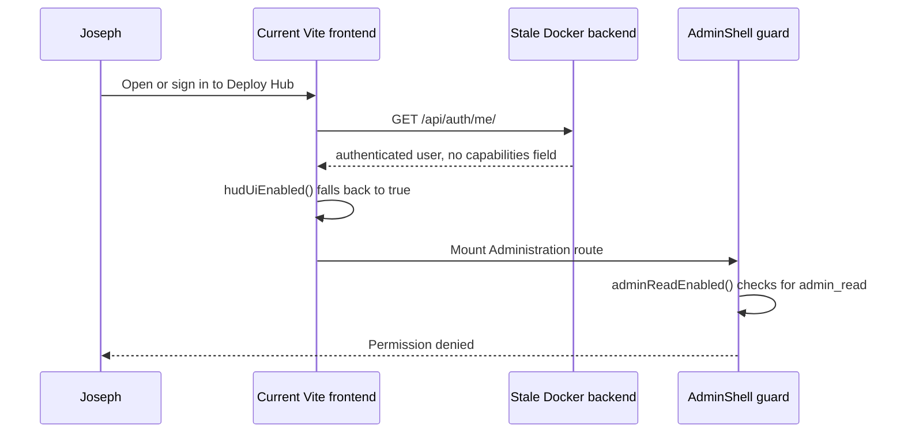
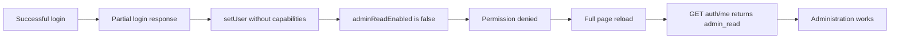
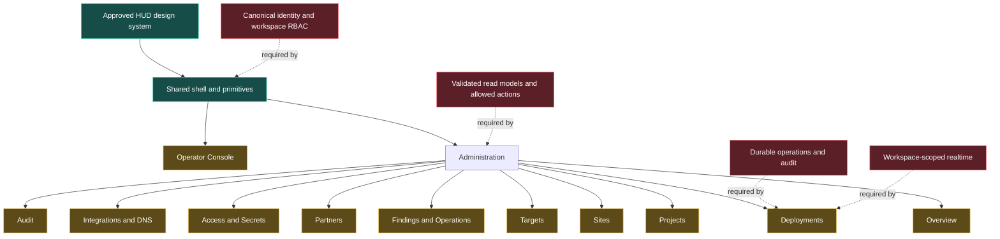
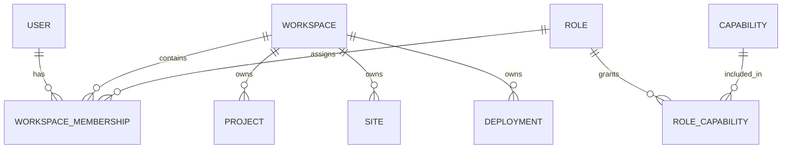
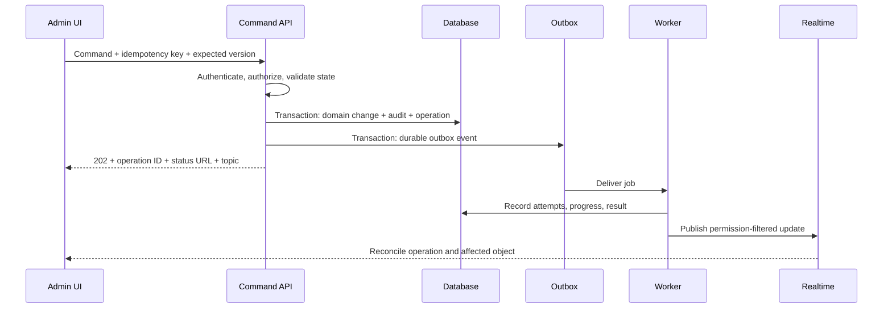
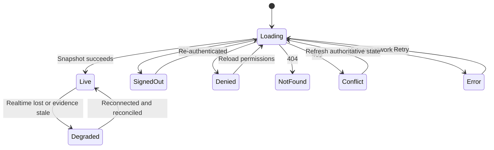
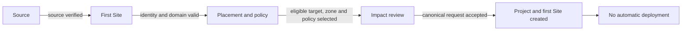
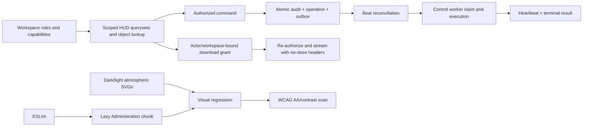
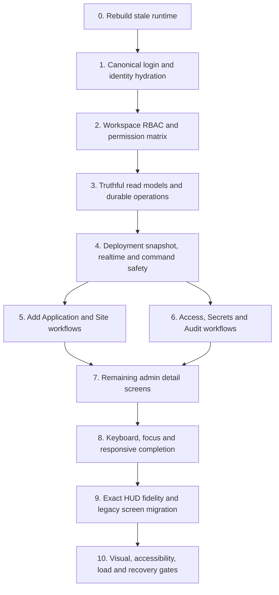

# Deploy Hub Current Frontend Review Report

**Review date:** 2026-08-27; implementation verification updated 2026-08-28  
**Reviewed against:** [Admin Panel Design Report](../admin-panel-design-report.md)  
**Supporting specifications:** [HUD Style Fidelity Specification](hud-style-fidelity-spec.md) and [Production Implementation Plan](production-implementation-plan.md)  
**Review team perspectives:** Product/UI design, UX and accessibility, frontend engineering, backend contract and runtime verification  
**Scope:** The original read-only review plus a verified implementation update for the previously deferred runtime, isolation, operations, download, frontend-quality, and atmospheric-asset gates.

> **Current status (2026-08-28):** The stale-runtime and false-permission diagnosis below describes the pre-fix snapshot. The relevant source has now been implemented, tested, migrated, rebuilt, and started. The running Compose service returns the current auth contract; migrations through `core.0020` are applied; all three Celery workers register the durable outbox tasks. See §11.1 for exact proof and residual limitations.

## 1. Executive summary

The current implementation is a strong HUD-style functional prototype with the previously deferred foundation now implemented. It still requires the remaining deployment-reconciliation, manual accessibility, responsive, recovery-drill, and release-approval gates before production sign-off.

The visual foundation is substantially in place: dark and light themes, Chakra Petch, fixed cutting-mat grid, fog layers, transparent HUD frames, status primitives, shared tables, inspectors, charts, timelines, and separate Operator and Administration navigation. The automated frontend and HUD API tests also pass.

The largest risks are not cosmetic. They are authorization, runtime consistency, backend truthfulness, durable command execution, realtime reconciliation, error recovery, and incomplete safety workflows. Several controls look operational while their data, command, or feedback path is incomplete. That conflicts with the design report's core rule: every visible control must have a real purpose, permission, backend effect, safety state, and auditable result.

The recurring **Permission denied** message was not caused by Joseph's role. It was caused by a stale backend image plus missing post-login capability hydration. The image has now been rebuilt and the login flow re-fetches `/api/auth/me/`; workspace roles and capabilities are returned from the authoritative session response.

### Overall assessment

| Area | Assessment | Production implication |
|---|---|---|
| HUD theme foundation | Strong | Suitable foundation; fidelity and regression work remain |
| Navigation and shell | Partial | Correct workspace separation, incomplete responsive and recovery behavior |
| Authentication hydration | Implemented and tested | Login refreshes canonical capabilities without a page reload |
| Authorization model | Implemented for HUD HTTP resources | Workspace RBAC/queryset isolation passes cross-workspace tests; realtime workspace partitioning remains a release gate |
| Deployment safety | Improved, not complete | Durable commands and signed downloads exist; snapshot/realtime recovery drills remain |
| Admin screen coverage | Partial | Core collections exist; most detail and lifecycle workflows are incomplete |
| Accessibility | Automated gate added | Axe WCAG 2.1 AA and contrast pass on representative dark/light screens; manual keyboard/screen-reader review remains |
| Responsive behavior | Weak | Tablet overflow and clipped navigation were observed |
| Automated verification | Stronger | Unit/API/build/lint plus Playwright visual and accessibility gates pass; broader permission/recovery matrices remain |

## 2. Review method and evidence

The review combined:

1. Source comparison against the approved design report and implementation plan.
2. Authentication, capability, navigation, screen, API, and command-path inspection.
3. Read-only inspection of the running Docker backend and database user flags.
4. Browser inspection of the local Vite frontend and simulated Administration workspace.
5. Existing automated test and production build verification.

### Original review results

- Frontend tests: **277 passed**.
- HUD API tests: **19 passed**.
- Production frontend build: **passed**.
- Built JavaScript: approximately **433.58 kB**, **126.45 kB gzip**, emitted as one principal bundle.
- Running database account: `Joseph`, active, staff, and superuser.
- Running backend `/api/auth/me/` implementation: does **not** return `capabilities`.
- Running backend image: does **not** contain the current HUD URL module.
- Source workspace `/api/auth/me/`: does return `hud_ui_v1` and, for staff/superusers, `admin_read`.

Passing structural tests do not remove the production blockers in this report. The current tests do not exercise the real Login → Administration transition, browser keyboard flows, role/action matrices, reconnect behavior, or visual fidelity at responsive breakpoints.

### 2026-08-28 implementation verification

- Frontend unit tests: **283 passed**.
- HUD API tests: **38 passed**, including cross-workspace reads/writes, idempotent outbox execution, actor-bound signed downloads, audit events, no-cache headers, and artifact size refusal.
- Backend non-T2/T3 suite: **2,468 passed**, **6 skipped**, with the sandbox-only localhost security test and 15 affected provider tests rerun separately and passing.
- ESLint: **passed with zero warnings**.
- Production frontend build: **passed**; Administration is emitted as a separate lazy chunk (approximately **60.95 kB**, **17.15 kB gzip**) and the principal bundle is approximately **388.05 kB**, **115.30 kB gzip**.
- Playwright accessibility/contrast: **6 passed** across Overview, Sites, and Deployment in dark and light themes.
- Playwright visual regression: **7 passed**, covering those three functional screens in dark/light plus the compact-navigation breakpoint.
- Full Playwright gate: **13 passed**.
- Running Docker stack: **7 services running**; web, deploy, probe, control, beat, PostgreSQL, and Redis.
- Running database: migrations `core.0016` through `core.0020` applied; default workspace and durable operation/outbox tables load successfully.
- Running workers: **3 nodes online** and all register `core.tasks.drain_hud_outbox` and `core.tasks.process_hud_outbox`.
- Running HTTP endpoint: `GET /api/auth/me/` responds normally from Daphne; unauthenticated proof returns the intended `{"authenticated": false}` contract.

## 3. Permission denied root cause

### 3.1 Current failure sequence



The implementation creates an asymmetric result:

- [`hudUiEnabled()`](../../frontend/src/flags.js) defaults to `true` when the capability array is missing.
- [`adminReadEnabled()`](../../frontend/src/flags.js) requires the explicit `admin_read` capability.
- [`AdminShell`](../../frontend/src/screens/administration/AdminShell.jsx) refuses access when `admin_read` is absent.

This is why the new HUD shell can appear while Administration remains denied.

### 3.2 Why the running backend is stale

[`docker-compose.yml`](../../docker-compose.yml) builds the web service from the repository but does not bind-mount the source tree. [`Dockerfile`](../../Dockerfile) copies the source into the image. Source changes therefore do not reach the running backend until the image is rebuilt.

Immediate operational recovery:

```bash
docker compose up -d --build web
```

Before exercising new asynchronous commands, rebuild the web process and workers together:

```bash
docker compose up -d --build
```

After rebuilding, reload the browser so `/api/auth/me/` hydrates the current identity.

### 3.3 Second defect: post-login capability loss

The source backend's [`LoginView`](../../core/views.py) returns username and enrollment state but not capabilities. [`Login.jsx`](../../frontend/src/screens/Login.jsx) immediately passes that partial response to `setUser`. [`App.jsx`](../../frontend/src/App.jsx) fetches the canonical `/auth/me/` response only during initial application hydration.

As a result, this can occur after the backend rebuild:



### 3.4 Permanent permission fix

1. Define one canonical session-user response containing authentication state, enrollment state, workspace memberships, roles, and capabilities.
2. Re-fetch `/api/auth/me/` after every password, TOTP, recovery-code, and passkey login, or return the exact canonical representation from the login endpoint.
3. Keep the shell in an identity-loading state until canonical hydration finishes.
4. Distinguish session expiry, stale capability state, and genuine missing permission.
5. Add **Reload permissions**, **Return to Operator Console**, and appropriate sign-in recovery to the denial state.
6. Move personal Profile and Security routes outside the admin-only Secrets screen. [`WorkspaceMenu.jsx`](../../frontend/src/ui/WorkspaceMenu.jsx) currently exposes those entries to normal users but routes both through Administration.

### 3.5 Required acceptance tests

- Staff user logs in and opens Administration without reloading.
- Non-staff user never sees Administration but can open personal Profile and Security.
- Capability removal during a session produces an explicit access-change state.
- Expired session produces a sign-in recovery state, not a generic HTTP error.
- Stale client identity can be repaired with Reload permissions.
- Every role/capability combination is enforced independently by the API, not only the UI.

## 4. Current frontend relationship to the approved design



The shell and screen map are present, but the blocked contract layers underneath them prevent production use.

## 5. What is already aligned

### 5.1 Visual system

- Measured typography, spacing, corner, grid, and header tokens exist.
- Dark and light themes use different covers, fog, grid, foreground, borders, and accent values.
- Background layers are fixed and correctly ordered.
- HUD panels remain transparent, unblurred, and shadowless.
- Frames use faint long edges with stronger L-shaped corners.
- Chakra Petch is locally bundled and applied.
- Statuses include words and symbols rather than relying only on color.
- Appearance switching is implemented.

### 5.2 Information architecture

- Operator and Administration are separate workspaces.
- The six-item Operator navigation remains intact.
- Administration contains Overview, Projects, Sites, Deployments, Targets, Findings and Operations, Partners, Access and Secrets, Integrations and DNS, and Audit.
- Shared records are used instead of creating a separate visual-only object model.

### 5.3 Shared primitives

- HUD frame
- Buttons
- Status
- Async region
- Data table
- Filter bar
- Inspector
- Timeline
- Chart
- Confirmation surface

These are a useful base, but several primitives need complete interaction, safety, and accessibility contracts.

## 6. P0 production blockers

### P0.1 Replace global staff authorization with workspace RBAC

[`RequireAdminRead`](../../core/hud_views.py) grants access based on global `is_staff` or `is_superuser`. The same broad condition protects both reads and mutations.

This does not implement the report's Viewer, Auditor, Operator, Deployer, Admin, and Owner model. It also cannot support workspace isolation, production approval separation, or action-specific capabilities.

Required backend model:



At minimum, separate capabilities should cover read, audit export, configuration, deployment request, production approval, deployment cancellation, rollback, secrets management, member management, and destructive lifecycle operations.

### P0.2 Make accepted commands durable

[`_accepted()`](../../core/hud_views.py) can return a synthetic `operation_id=1`. Target creation, Partner creation, Site creation, and some integration verification commands can claim to be queued without creating a durable operation or job.

Every command must use this production flow:



No button may report success merely because the HTTP request was sent.

### P0.3 Remove fabricated or inferred operational state

Current examples include:

- Site TLS reported as `ok` regardless of actual certificate evidence.
- Live and desired release derived from the same latest manifest.
- Deployment live release guessed as desired version minus one.
- Integration health partly hardcoded.
- Source connection testing based largely on input shape.

Every operational value must include an authoritative source, observation timestamp, and freshness/degraded state. Unknown is preferable to invented certainty.

### P0.4 Make deployment detail authoritative

[`LiveDeployment.jsx`](../../frontend/src/screens/administration/LiveDeployment.jsx) currently:

- Loads a snapshot once.
- Ignores the shared realtime object passed by the shell.
- Creates some actions in the frontend.
- Sends commands without awaiting their result.
- Does not show command failure, refusal, operation ID, or authoritative refresh.
- Uses placeholder log and artifact content.
- Announces every impact headline as an alert.

Production requirements:

- Snapshot-then-stream subscription scoped to the selected deployment.
- Attempt and step timestamps, duration, checks, retries, heartbeat, and freshness.
- Real log chunks with cursoring, truncation state, and signed download.
- Real artifact metadata and audited download.
- Only server-authorized actions.
- Named rollback candidate.
- Server-computed safe-next recommendation and reason.
- Busy, accepted, running, refused, conflict, failed, and completed feedback.
- Assertive announcements only for new failure or user-impact events.

### P0.5 Implement real safety confirmations

The current confirmation primitive cannot display the before/after and impact contract required by the report.

T2 confirmation must display:

- Exact action and object identity.
- Current value/state.
- Proposed value/state.
- Affected sites, targets, routes, secrets, and dependencies.
- Expected interruption or no-interruption statement.
- Rollback/recovery availability.
- Policy/window/approval implications.
- Server refusal reason when unavailable.

T1 destructive confirmation must additionally require verified step-up authentication and exact typed identity. The UI must not mark hardware verification successful when its backend call fails.

### P0.6 Build a complete recovery state machine



Most current screens do not provide a working Retry action. Overview's Retry changes its visual phase without triggering a new request. The shared async primitive should model these states consistently and preserve safe existing data during background retry.

## 7. P1 major workflow gaps

### P1.1 Add Application wizard

The four step shell exists, but it is not foolproof:

- Continue is always enabled.
- Source validation does not gate progress.
- Placement and policy is explanatory text, not form controls.
- Site name and environment are collected but omitted from the create request.
- DNS zone, Target, strategy, deploy policy, and window are not submitted.
- There is no unsaved-change protection, draft, uniqueness check, or field-level server error mapping.

Required gate relationship:



### P1.2 Sites Fleet and Site detail

The collection needs decision-critical fields:

- Owner
- Environment and exposure
- Domain and TLS state
- Current and desired release
- Active Deployment and current step
- Health and observation freshness
- Target and copy count
- Policy and next deployment window
- Backup coverage and age
- Highest Finding severity
- Last deployment actor and timestamp

The existing `TLS/backup` column only displays TLS. The inspector repeats a few row values and disabled actions but does not provide the report's actual operational summary.

Missing Site detail tabs:

- Overview
- Configuration
- Environment and Secrets
- Releases and Manifests
- Instances and Networking
- Backups
- Adoption
- Activity
- Removal/decommission flow

### P1.3 Access and Secrets

Current problems include:

- Members content is rendered twice.
- Add Secret, Invite, Rotate, and Review Rotation Plan appear outside the contexts that make them valid.
- Roles, Sessions, and Security are mostly prose or fallback lists.
- Secret lifecycle status is inferred from exportability, which is semantically incorrect.
- Secret kind, owner type, and owner ID use free-text inputs.
- Invite requests only a username.

Required correction:

- Server-authorized actions per tab and selected object.
- Typed, kind-specific secret wizard.
- Owner picker constrained to accessible workspace objects.
- Dependency and reference-health review.
- Active version, algorithm, KEK, creator, dates, last use, rotation, and lifecycle status.
- Member email, status, workspace role, passkeys, TOTP, recovery count, last login, sessions, and invitation state.
- Session revoke and personal security flows outside the Admin permission boundary where appropriate.
- Secret values remain write-only and never return to the browser.

### P1.4 Remaining Administration areas

Targets, Partners, Findings and Operations, Integrations and DNS, and Audit are largely collection shells. They need their report-defined detail tabs, filters, dependency impact, lifecycle operations, audit context, recovery actions, and pagination.

Examples:

- Operations need owner, age, heartbeat, lock expiry, result, and safe cancel/refusal state.
- Audit needs actor, action, object, result, source IP, correlation ID, diff/metadata, retention, filtering, and export.
- Integrations need verified identity/scope, last check, dependency impact, disconnect consequences, budget/cost state, and Origin CA/DNS details.
- Partner suspension must display affected Sites, credentials, intake state, and recovery path.
- Target decommission and purge must use dependency-aware plans.

### P1.5 API and realtime contracts

- Administration currently consumes raw JSON rather than validating all responses through the Zod/OpenAPI layer.
- The generated OpenAPI document covers only part of the HUD surface.
- No Administration screen subscribes directly to the shared event client.
- The operation drawer is a route-triggered snapshot, not a live operation system.
- Workspace and object authorization for realtime topics is incomplete.

Required rule: malformed or unknown server actions must not render, and realtime events must always be reconciled against the latest authorized snapshot.

## 8. Interaction, accessibility, and responsive review

### 8.1 Tables and actions

[`DataTable.jsx`](../../frontend/src/ui/DataTable.jsx) makes rows clickable with a mouse but does not provide keyboard focus or activation. Column headers are not sortable controls, and every row action is rendered inline.

Required pattern:

- The primary object name is a real link or button.
- Row click remains only a pointer convenience.
- Sortable headers are buttons with direction state.
- Each row has at most one contextual primary action.
- Remaining actions live under a text-labelled **More actions** menu.
- Destructive actions are separated and never adjacent to routine actions.
- Disabled actions expose their reason without permanently expanding every row.

### 8.2 ARIA and focus

The following patterns are incomplete:

- Tab lists lack complete tab/tab-panel semantics.
- Search listbox lacks combobox relationship, active option, arrow navigation, Escape, empty, and error states.
- Confirmation dialogs lack modal semantics, focus containment, Escape behavior, and focus restoration.
- Inspector drawers lack backdrop, focus management, background inertness, and return focus.
- Workspace menu lacks full keyboard navigation and outside/Escape dismissal.

### 8.3 Empty and filtered states

The table primitive currently conflates an empty collection with no filter matches.

- Empty collection: explain the missing setup and offer the relevant create/setup action.
- No matches: show the active filter summary and offer **Clear filters**.

### 8.4 Responsive browser findings

At an approximately 800px-wide viewport, browser inspection showed:

- Header content overflowing.
- Administration navigation labels clipped into fragments.
- Horizontal page scrolling.
- Sites mobile behavior replacing Administration with a link back to Operator rather than presenting a compact authorized view.

The sidebar should use an accessible icon/drawer strategy at compact widths. The header should move low-frequency controls into overflow. Tables need standard compact card/list fallbacks, and deep links must remain useful on phone screens.

## 9. HUD visual fidelity review

### 9.1 Correct foundation

- The cutting-mat grid is present and fixed.
- Fog and cover layers are independent.
- Major panels remain transparent so the background continues through them.
- Light mode is independently tokenized rather than being a simple inversion.
- Frames use the intended long edges and reinforced corners.
- The typography direction is consistent with the reference.

### 9.2 Remaining fidelity gaps

The dark and light cover SVGs are primarily large radial gradients. They produce a clean layered background but not the irregular atmospheric depth of the reference. Replace them with purpose-built atmospheric covers while preserving the existing grid/fog/panel layer architecture.

Additional gaps:

- Secondary and navigation button variants lack distinct production styling.
- Charts and timelines are mostly unstyled structural output.
- Deployment activity does not represent real time-bucketed outcomes.
- Appearance previews show flat colors rather than the complete cover/grid/fog/header system.
- Legacy Operator screens still use old inline surfaces and literal colors.
- Theme preference is device-global instead of per user/workspace.

No visual treatment should be considered complete until it has a functional loading, empty, error, denied, disabled, busy, degraded, and live state in both themes.

## 10. Testing and delivery gaps

Current tests provide a useful regression base, but production assurance still needs:

- Login → Administration browser test without page reload.
- Non-admin Profile and Security navigation test.
- Workspace role/action permission matrix at the API layer.
- Test proving every visible action has a live handler and authorized endpoint.
- Durable 202 operation creation and idempotency tests.
- Realtime reconnect, missed-event reconciliation, and stale snapshot tests.
- Keyboard-only tests for navigation, tables, menus, drawers, tabs, search, and dialogs.
- Automated accessibility scan in dark and light themes.
- Contrast sampling over bright and dark cover regions.
- Visual regression baselines at desktop, compact desktop, tablet, and phone widths.
- Deployment failure, cancel, retry, rollback, and recovery drills.
- Real lint configuration.
- Route-level code splitting for Administration screens.

## 11. Prioritized implementation roadmap

### 11.1 Deferred-gate implementation outcome

The following table supersedes the original deferred list. “Implemented” means the source path and the stated automated/runtime proof exist; it does not waive the residual release work in the final column.

| Gate | Outcome and implementation | Verified proof | Residual release work |
|---|---|---|---|
| Rebuild the running Docker image | **Implemented.** Rebuilt the shared image, migrated first, then recreated web, workers, and beat. | Seven Compose services running; live Daphne response; `core.0020` applied; three Celery nodes online. | Publish an immutable image digest/build ID in release metadata and automate rollback. |
| Workspace queryset isolation | **Implemented for HUD HTTP resources.** Added `Workspace`, per-workspace memberships/roles/capabilities, explicit ownership fields, scoped query helpers, per-workspace slug constraints, and foreign-object refusal. | HUD API cross-workspace list/detail/create/action tests pass; source and live migrations verified. | Partition legacy global realtime topics by workspace and complete a full endpoint permission matrix. |
| Durable outbox and workers | **Implemented.** An accepted command transaction writes audit event, durable operation, and IDs-only outbox row; Beat reconciles pending/stale claims; workers record attempts, heartbeat, terminal result/error, and timestamps. | Exactly-once/idempotency tests pass; live control/deploy/probe workers register both outbox tasks. | Add broker/database failure-injection drills, retry classification policy, metrics, alerts, and operator replay controls. |
| Signed log and artifact downloads | **Implemented.** Grant and redemption both enforce authentication, workspace scope, actor binding, deployment/resource binding, short expiry, size cap, attachment/no-cache/nosniff headers, and audit events. | Actor-reuse refusal, audited log completion, IDs-only grant response, and oversized-artifact refusal tests pass. | Move large/binary artifacts to managed object storage, add explicit revocation if business policy requires it, and exercise expiry in an integration clock test. |
| Visual regression testing | **Implemented baseline gate.** Playwright stores reviewed dark/light desktop baselines for Overview, Sites, and Deployment plus compact navigation. | Seven screenshot comparisons pass. | Add tablet/phone and remaining high-risk screens; require intentional baseline approval in CI. |
| Automated accessibility and contrast scans | **Implemented baseline gate.** Axe scans representative functional screens using WCAG 2.0/2.1 A/AA tags in both themes, including automated color-contrast rules. | Six scans pass with zero violations. | Manual keyboard and screen-reader review, 200% zoom, reduced motion/data, and expanded route coverage remain mandatory. |
| ESLint and code splitting | **Implemented baseline gate.** Flat ESLint configuration fails on warnings; Administration loads through `React.lazy`/`Suspense` as a separate chunk. | Lint, unit tests, and Vite build pass; emitted Administration chunk measured separately. | Add enforceable bundle budgets, chunk-load recovery UI, and CI artifact reporting. |
| Atmospheric cover SVGs | **Implemented.** Original dark/light assets use organic gradient forms, turbulence, displacement, blur, fog depth, and preserve the fixed cutting-mat grid/frosted-glass layer system. | XML validation passes; both assets are exercised by visual baselines; provenance is recorded in the asset notice. | Obtain final product/design approval and test reduced-data rendering on low-power devices. |



Production sign-off remains intentionally separate from implementation completion. The remaining realtime partitioning, manual assistive-technology checks, responsive expansion, failure drills, observability, immutable release identity, and approval record still require named owners.

### 11.2 Implementation dependency map



### Milestone 0 — Runtime consistency

- Rebuild current backend services.
- Verify the running commit/image identifier in the shell.
- Add a visible build/version diagnostic available to authorized administrators.

**Exit:** `/api/auth/me/` and the HUD endpoints in the running service match the workspace source.

### Milestone 1 — Truthful and recoverable identity

- Canonical user serialization.
- Post-login hydration.
- Personal Profile/Security routing.
- Complete permission and session-expiry states.

**Exit:** every supported user reaches the correct workspace without false denial.

### Milestone 2 — Authorization and durable backend foundation

- Workspace membership and capabilities.
- Per-action endpoint authorization.
- Realtime topic authorization.
- Durable operation/outbox/idempotency contract.
- Truthful timestamped read models.

**Exit:** no frontend control relies on global staff status or synthetic accepted work.

### Milestone 3 — Deployment control plane

- Deployment attempts/events.
- Snapshot-then-stream detail.
- Logs and artifacts.
- Safe confirmations and refusal handling.
- Operation drawer integration.

**Exit:** a failure, cancel, retry, and rollback can be completed and audited from the new UI.

### Milestone 4 — Complete administration workflows

- Add Application.
- Site details and lifecycle.
- Targets, Findings/Operations, Partners, Access/Secrets, Integrations/DNS, and Audit.

**Exit:** no screen is merely a collection shell and every visible control has a real effect.

### Milestone 5 — Experience and release hardening

- Keyboard/focus completion.
- Responsive patterns.
- Exact cover assets and visual component completion.
- Legacy Operator migration.
- Visual, accessibility, load, permission, and recovery gates.

**Exit:** all production definition-of-done criteria in the implementation plan are satisfied.

## 12. Definition of ready for production

The Administration workspace is ready only when all of the following are true:

- The running image is identifiable and matches the released source.
- Login never requires a reload to obtain capabilities.
- Workspace RBAC is enforced at every API, queryset, command, and realtime topic.
- Every visible button is server-authorized or a genuinely local, non-mutating UI action.
- Every `202 Accepted` response points to a real durable operation.
- The interface never presents inferred or placeholder operational evidence as fact.
- Deployment detail reconciles snapshot and realtime events.
- Commands show busy, accepted, refused, conflict, failed, and completed states.
- Destructive and disruptive actions display server-computed impact.
- Secrets never return to the browser.
- Collections, filtered-empty states, errors, denied states, stale states, and deleted records are distinguishable.
- All object details and safety-critical actions are keyboard accessible.
- Tablet and phone layouts retain useful authorized read access.
- Dark and light visual regression, accessibility, permission, realtime, and recovery test gates pass.
- Operations has completed at least one production-like deployment failure and recovery drill using the new interface.

## 13. Final recommendation

Do not add more decorative dashboard elements until the current controls are truthful, recoverable, and fully authorized. The next milestone should be **truthful and recoverable Administration**:

1. Repair the runtime and identity path.
2. Establish workspace RBAC.
3. Replace synthetic commands and inferred states.
4. Complete deployment realtime and command safety.
5. Finish the core workflows before expanding visual polish.

The existing HUD theme and component foundation should be preserved. The implementation should now move from a convincing prototype to an auditable control plane whose visual confidence is matched by backend truth.
