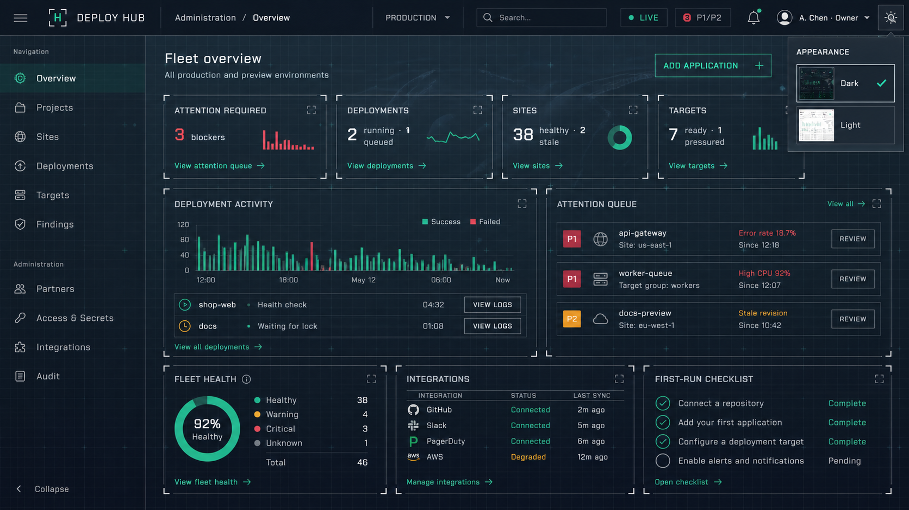
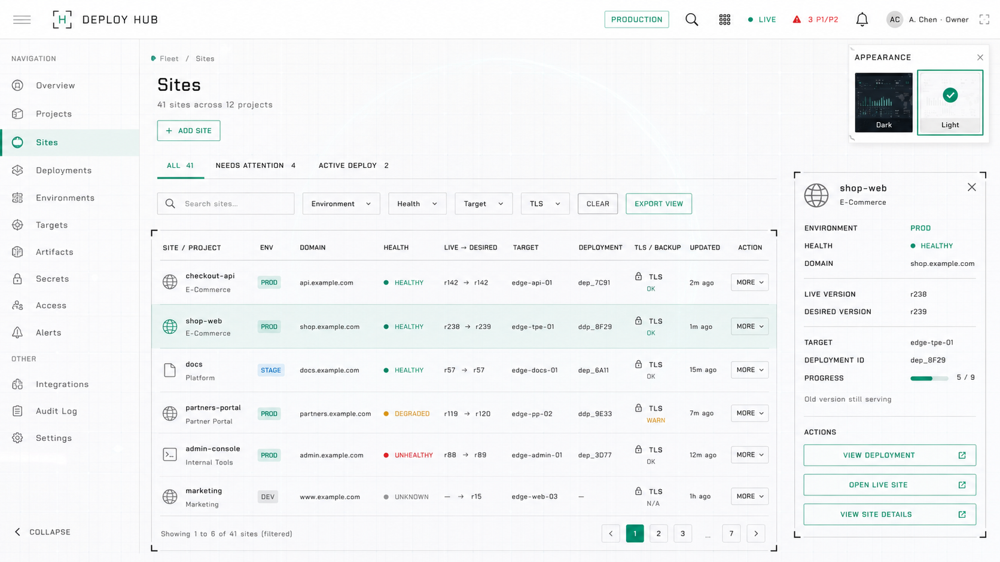
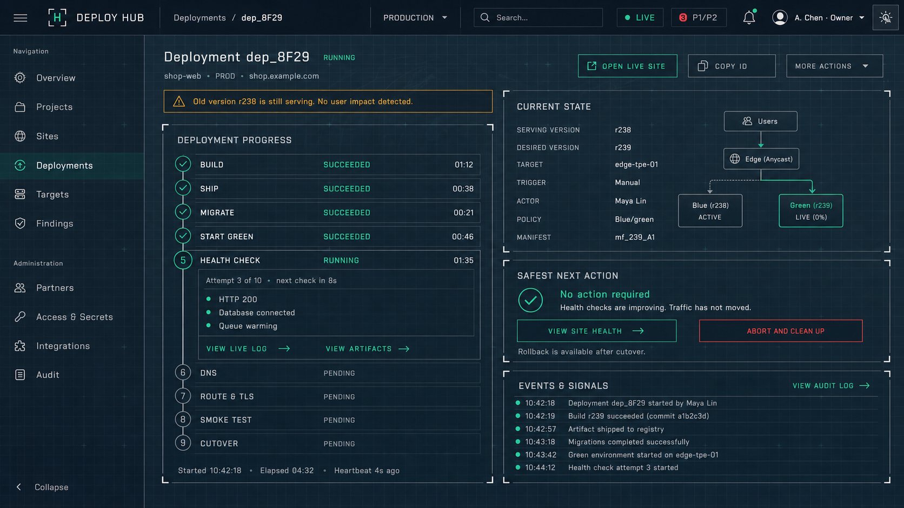
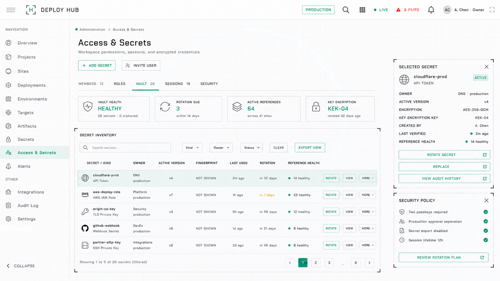

# Deploy Hub HUD Production Implementation Plan

**Status:** Production handoff plan; no frontend code is included in this document  
**Date:** 2026-08-27  
**Audience:** Product, UX, visual design, frontend, backend, accessibility, security, QA, and release engineering  
**Goal:** Implement the approved Deploy Hub administration and operator experience with high fidelity to the referenced HUD material system without weakening the existing deployment-safety contracts.

---

## 1. Purpose and authority

This document converts the visual concepts, functional contracts, repository findings, and measured HUD reference properties into an ordered production plan.

Use these artifacts together:

1. [Admin Panel Design Report](../admin-panel-design-report.md) — product model, workflows, button inventory, safety tiers, backend architecture, and delivery phases.
2. [Functional Screen Contract](functional-screen-contract.md) — the purpose, destination/effect, permission, availability, feedback, and audit outcome of visible controls.
3. [HUD Style Fidelity Specification](hud-style-fidelity-spec.md) — measured dark/light materials, typography, background layers, panel construction, and appearance behavior.
4. This production plan — repository-specific implementation sequence, ownership, quality gates, and rollout controls.

When documents appear to conflict, resolve them in this order:

1. Security, authorization, deployment integrity, and audit requirements.
2. Functional Screen Contract.
3. Admin Panel Design Report.
4. HUD Style Fidelity Specification.
5. Raster design concepts.

The PNGs communicate composition and visual intent. They are not a source of API truth, authorization rules, exact copy, or hidden interaction behavior.

---

## 2. Current approved concept files

### 2.1 Fleet overview — dark mode



Use this concept for:

- Global shell proportions.
- Dark-mode background layering.
- Transparent metric and operations panels.
- Fleet attention hierarchy.
- Appearance selector behavior.
- Dashboard information density.

Do not copy third-party integration logos from the concept without confirming that the matching integration exists and the icon asset is licensed.

### 2.2 Sites fleet — light mode



Use this concept for:

- Light-mode material and contrast.
- Server-filtered table density.
- Selected-row treatment.
- Contextual row action placement.
- Right-side object inspector.
- Appearance selector in the selected Light state.

### 2.3 Live deployment — dark mode



Use this concept for:

- Impact-first deployment detail.
- Nine-step lifecycle presentation.
- Current-versus-desired topology.
- Live health evidence.
- Recovery-action hierarchy.
- Immutable event history.

### 2.4 Access and secrets — light mode



Use this concept for:

- Metadata-only Vault inventory.
- Role-gated administration navigation.
- Light-mode security tables.
- Selected-secret dependency summary.
- Secret lifecycle actions without revealing values.

### 2.5 Supporting relationship diagrams

#### Domain model


#### Deployment journey


#### Deployment state machine


#### Command execution flow


---

## 3. Latest findings from the reference and repository

### 3.1 HUD material findings

The reference does not achieve its fog-glass effect with blurred cards. The observed layer order is:

1. Base body color.
2. Fixed atmospheric cover image.
3. Strong fixed vertical fog gradient.
4. Fixed repeating 75px cutting-mat pattern.
5. Transparent content and panels.
6. More opaque header and appearance popover.

The panel frame is also specific:

- Transparent interior.
- Top and bottom 1px lines inset 15px.
- Left and right 1px lines inset 15px.
- Four 10px corner containers.
- Each corner contains 2px horizontal and vertical strokes.
- Long edges are faint; corners are substantially brighter.
- No card shadow.

Measured shared values:

- Font: Chakra Petch.
- Body size: 14px.
- Letter spacing: 0.75px.
- Base line height: 1.5.
- Pattern tile: 75px.
- Header height: approximately 52px.
- Primary panel radius: 4px.
- Small control radius: approximately 2px.

Measured dark values:

- Base: `#1d2835`.
- Fog: `rgba(50,70,80,.90)` to `#0d101b`.
- Accent: `#3cd2a5`.
- Text: `rgba(255,255,255,.75)`.
- Border: `rgba(255,255,255,.25)`.
- Header: `rgba(29,40,53,.95)`.

Measured light values:

- Base: `#ffffff`.
- Fog: `rgba(255,255,255,.90)` to `rgba(255,255,255,.99)`.
- Accent: `#249d79`.
- Text: `rgba(0,0,0,.75)`.
- Border: `rgba(0,0,0,.20)`.
- Header: `#ffffff`.

### 3.2 Current frontend findings

The current frontend is intentionally small:

- React 18.3 and Vite 5.4.
- No router library; navigation uses a tested hash router.
- No design-system or chart dependencies.
- Styling is almost entirely repeated inline style objects.
- `frontend/index.html` hard-codes the current body colors and monospace font.
- The same `box` object is duplicated across Chrome, App, Readiness, Map, Sites, Targets, Deploys, Findings, Settings, Login, Enroll, and Tiers.
- The six-item operator navigation is pinned by `frontend/tests/nav.test.ts`.
- The 390px phone scope is pinned for finding detail, Site status, Deployment status, and the T1 overlay.
- Map remains intentionally desktop-only.
- Realtime state is centralized in one multiplexed socket with snapshot-then-stream, gap recovery, degraded polling, and visible stale timestamps.
- The existing test currently requires the live connection pill to render nothing.
- Deployment list/detail data remains incomplete; `Deploys.jsx` is still primarily a UI contract and empty state.
- Settings already contains Security, Cloudflare, AWS, Partners, Developer, and Vault tabs.

### 3.3 Consequence

This cannot be implemented safely as a page-by-page reskin. A direct reskin would:

- Duplicate new colors and materials across more inline objects.
- Make dark/light behavior inconsistent.
- Cause corner-frame construction to drift between screens.
- Risk breaking existing navigation and degraded-state tests.
- Make visual review depend on subjective screenshots instead of stable tokens.
- Produce screens that look complete before their server contracts exist.

The foundation must land before the screen redesigns.

---

## 4. Non-negotiable decisions

### N1 — Function beats resemblance

No visual detail may hide status, reduce contrast, obscure a refusal reason, or imply an unavailable action.

### N2 — One material implementation

The cutting-mat background, fog cover, panel frames, corner brackets, header, controls, type, and themes must each have one shared implementation. Screens must not recreate them locally.

### N3 — No local colors

After the foundation phase, new components may not contain literal hex, RGB, HSL, or named colors. They consume semantic tokens only.

### N4 — Dark and light ship together

A component is unfinished until it passes both themes. Light mode is not deferred cleanup.

### N5 — Server-authorized actions

Buttons derive from server-returned `allowed_actions` and `disabled_actions`. The frontend does not infer permission or safety from visual state.

### N6 — Preserve tested operational behavior

Snapshot-then-stream, sequence-gap recovery, degraded polling, exact action tiers, no-dead-end empty states, and phone-scope contracts remain intact throughout migration.

### N7 — Separate workspaces

Keep the existing six-item Operator Console navigation. Add the Administration workspace as a separate role-gated shell reached through the user/workspace menu. Do not merge all administration links into the existing six-item operator navigation without an explicit product decision and updated navigation contract.

### N8 — No vendor-asset assumption

Before copying the reference theme’s cover, pattern, icon, CSS, or font files, confirm the project has the required commercial license and redistribution rights. If it does not, create original cover and grid assets that reproduce the measured layering behavior without copying vendor files.

### N9 — Concepts are not fixtures

Never hard-code the example names, counts, timestamps, domains, or statuses shown in the PNGs. Deterministic simulated data belongs only in the existing simulation/test system.

### N10 — No production demo route

Component and screenshot fixtures must use a development/test-only harness or the existing simulation mechanism. Do not add Style Guide, Demo, or Advisor to product navigation.

---

## 5. Decisions required before implementation

Record these as short architecture decision records before the first UI pull request.

| ID | Decision | Recommended answer | Why it matters |
|---|---|---|---|
| D1 | Reference asset license | Verify before importing; otherwise create original equivalents | Prevents unlicensed production assets |
| D2 | Connection indicator when live | Show a small persistent `LIVE` state in Administration; retain current behavior in Operator Console until its test/product contract is deliberately changed | Reconciles the concept with the existing “live renders nothing” test |
| D3 | Theme persistence | User preference first; OS preference only before an explicit selection; optionally sync preference to user profile | Prevents theme flicker and unexpected changes |
| D4 | Administration routing | Separate Admin shell with nested hash routes during this migration | Preserves the current routing model and operator navigation |
| D5 | Icon system | Locally bundled Bootstrap Icons or a small approved outline-SVG set | Matches reference weight and avoids mixed icon families |
| D6 | Chart approach | Shared accessible SVG primitives for current needs; add a chart library only if requirements exceed them | Keeps bundle small and visuals consistent |
| D7 | Feature rollout | `hud_ui_v1` capability/feature flag with old shell available for rollback | Limits operational risk |

No developer should decide one of these incidentally inside an unrelated screen pull request.

---

## 6. Target frontend structure

The following is the intended file ownership model. Exact filenames may change once, during foundation review; after that they are stable.

```text
frontend/src/
├── assets/
│   └── theme/
│       ├── cover-dark.*
│       ├── cover-light.*
│       ├── pattern-dark.*
│       ├── pattern-light.*
│       └── NOTICE.md
├── styles/
│   ├── tokens.css
│   ├── themes.css
│   ├── reset.css
│   ├── typography.css
│   ├── shell.css
│   ├── components.css
│   ├── states.css
│   └── responsive.css
├── ui/
│   ├── AppShell.jsx
│   ├── TopBar.jsx
│   ├── SideNav.jsx
│   ├── AppearanceMenu.jsx
│   ├── HudFrame.jsx
│   ├── Button.jsx
│   ├── Icon.jsx
│   ├── Status.jsx
│   ├── DataTable.jsx
│   ├── FilterBar.jsx
│   ├── Inspector.jsx
│   ├── Timeline.jsx
│   ├── Chart.jsx
│   ├── EmptyState.jsx
│   ├── AsyncRegion.jsx
│   └── ConfirmAction.jsx
├── theme/
│   ├── theme-store.js
│   ├── ThemeProvider.jsx
│   └── useTheme.js
├── screens/
│   ├── operator/
│   └── administration/
└── test-fixtures/
    └── visual-states.js
```

Ownership rules:

- Only the theme/design-system owner changes `styles/tokens.css`, `styles/themes.css`, `HudFrame`, or base control geometry.
- Screens compose primitives; they do not implement their own frame corners or theme logic.
- Domain screens own data transformation and screen-specific layout, not global colors.
- `NOTICE.md` records the source, license, modification status, and permitted distribution of every theme asset.

---

## 7. Theme implementation contract

### 7.1 Root state

Use one root theme attribute with only valid values:

- `data-theme="dark"`
- `data-theme="light"`

Do not add screen-local dark classes.

### 7.2 Initial theme resolution

Resolve appearance before React paints:

1. Read the validated user preference.
2. If none exists, read the OS color-scheme preference.
3. Apply the root theme attribute.
4. Load React.

This prevents a white flash in dark mode or a dark flash in light mode.

### 7.3 Persistence

- Store a local preference under one versioned key such as `deploy-hub.appearance.v1`.
- Accept only `dark`, `light`, or an optional `system` value.
- If the backend later stores appearance, resolve server-versus-local precedence in a documented migration.
- Appearance selection creates no security or operational audit event.

### 7.4 Token layers

Tokens must be semantic:

- Raw palette: base colors and opacities.
- Theme roles: page, header, text, muted, border, frame corner, accent, warning, danger, success.
- Component roles: control surface, selected row, input border, focus ring, table rule, chart grid.

Components consume theme or component roles, never raw palette tokens.

### 7.5 Background composition

Implement one shared viewport background component or pseudo-element stack:

1. Base color.
2. Licensed or original cover.
3. Fog gradient.
4. 75px pattern.

Acceptance:

- Background remains fixed while content scrolls.
- Grid position is identical behind sidebar, page content, and panels.
- No seam appears at workspace boundaries.
- Cover does not reduce text contrast.
- Mobile receives an optimized asset, not the full desktop cover.
- Reduced-data mode may omit the cover while preserving base, gradient, and grid.

### 7.6 Theme switching

The Appearance button:

- Has an accessible name.
- Opens a keyboard-navigable popover.
- Shows Dark and Light preview thumbnails with text labels.
- Indicates selection with word, check, and border; never color only.
- Keeps route, selected object, filters, table page, drafts, and active commands unchanged.
- Updates chart colors without remounting or losing realtime state.
- Respects reduced motion.

---

## 8. Core visual primitives

### 8.1 `HudFrame`

Purpose: the only implementation of the transparent panel and registration-corner frame.

Required variants:

- `panel`: large content region.
- `compact`: metric and summary card.
- `inspector`: right-side detail region.
- `popover`: appearance and small utility menus.
- `critical`: same geometry with danger semantics, not a different visual language.

Required behavior:

- Corners are decorative and hidden from assistive technology.
- Panel content remains semantic HTML.
- Frame never intercepts pointer events.
- Long edge and corner opacity come only from tokens.
- No screen may construct the frame with local pseudo-elements.

### 8.2 Buttons

Required variants:

- Primary mutation.
- Secondary mutation.
- Navigation.
- Destructive.
- Quiet/icon.

Every button supports:

- Default, hover, focus-visible, pressed, disabled, busy, and permission-refused states.
- Stable label while busy.
- Spinner or progress without layout shift.
- Minimum 44px touch target on phone screens even when the desktop visual height is smaller.
- `aria-describedby` for disabled reasons where native disabled would hide the explanation.

### 8.3 Status

Use a shared mapping for:

- Deployment states.
- Step states.
- Site health.
- Target readiness.
- Findings severity.
- Connection state.
- Secret lifecycle state.

Each status defines:

- Symbol.
- Word.
- Semantic foreground/background/border.
- Screen-reader copy.
- Sorting priority.

Color is never the only signal.

### 8.4 Data table

The shared table must implement:

- Server sorting and filtering.
- Sticky header where useful.
- Row selection with `aria-selected`.
- Keyboard movement that does not trap focus.
- Text-labelled action or `More` control.
- No hidden row-wide destructive click.
- Skeleton, empty, no-match, partial-error, and stale states.
- Horizontal-scroll affordance below desktop breakpoint.
- Column priority rules rather than arbitrary clipping.
- Accessible caption or screen title association.

### 8.5 Inspector

- Appears beside the table on wide screens.
- Becomes a drawer between tablet and compact desktop widths.
- Becomes a normal page/section on phone.
- Has a visible close control only when overlaying content.
- Preserves the selected row and scroll position when closed.
- Reads the same authoritative record as the row.

### 8.6 Charts

Charts must answer a named operational question.

- Every chart has title, range, legend, and accessible data representation.
- Microcharts are non-interactive unless they expose an explicit link.
- Theme change redraws palette tokens.
- Warning and failure colors remain semantically stable.
- Do not animate live charts continuously.
- Pause visual motion when the document is hidden.
- Never import a large chart library solely to copy the reference demo.

### 8.7 Async region

One component owns:

- Initial loading.
- Background refresh.
- Full error.
- Partial error.
- Degraded/stale state.
- Session expired.
- Permission denied.
- Not found/deleted.
- Conflict.
- Accepted async command.

This component must preserve current confirmed data during background refresh or transient failure.

---

## 9. Shell and navigation plan

### 9.1 Preserve the Operator Console

Keep the existing operator navigation contract:

1. Home
2. Sites
3. Targets
4. Deploys
5. Findings
6. Settings

The visual form may move from a compact top row to the HUD sidebar, but IDs, order, labels, route behavior, unknown-route fallback, and accessibility semantics remain tested.

### 9.2 Add Administration as a distinct workspace

Entry point:

- User/workspace menu → `Administration`.
- Visible only with an administration-read capability.

Administration navigation:

1. Overview
2. Projects
3. Sites
4. Deployments
5. Targets
6. Findings & Operations
7. Partners
8. Access & Secrets
9. Integrations & DNS
10. Audit

Administration routes must not be inferred merely from a hidden link. Both route loader and API queries enforce capabilities.

### 9.3 Global header

Implement:

- Breadcrumbs.
- Environment/workspace scope.
- Global search.
- Realtime state.
- P1/P2 shortcut.
- Operation drawer.
- Appearance selector.
- User and role menu.

Do not add inactive grid/menu icons merely to resemble the reference screenshot.

### 9.4 Realtime compatibility

- Keep one socket client per shell.
- Theme changes may not recreate the socket.
- Workspace change unsubscribes old topics and snapshots new topics.
- The operation drawer subscribes through the same client.
- Degraded polling retains `data as of` on affected regions.
- Resolve D2 before changing the current “live renders nothing” test.

---

## 10. Screen implementation plans

### 10.1 Fleet Overview

#### Required backend read model

Provide one workspace-scoped response containing:

- Counts by finding severity.
- Counts by deployment active state.
- Counts by Site health/drift.
- Counts by Target readiness.
- Deployment activity buckets.
- Active Deployment summaries.
- Ranked attention items.
- Integration verification status.
- Incomplete setup tasks.
- `observed_at`, response version, and authorized links.

Do not compose the dashboard through twelve unrelated client requests.

#### Implementation order

1. Shell title, scope, and primary action.
2. Metric cards with explicit drill-down links.
3. Attention queue.
4. Active deployment rows.
5. Fleet/integration/setup panels.
6. Chart after its read model is stable.

#### Acceptance

- No card mutates fleet state.
- Counts match filtered destination lists.
- Each region can fail independently.
- No stale data is shown without freshness.
- First-run checklist disappears when complete.

### 10.2 Sites Fleet

#### Required backend read model

The list endpoint must support:

- Search.
- Environment, ownership, exposure, health, manifest, target, Deployment, TLS, Findings, and preview filters.
- Stable sorting.
- Cursor or numbered pagination.
- Authorized export.
- Per-row `allowed_actions` and `disabled_actions`.
- Site, Project, domain, health, live/desired Release, Target, active Deployment, TLS, backup, Finding, and freshness summaries.

#### Implementation order

1. URL-backed filter state.
2. Table shell and loading/empty/error/no-match states.
3. Server sorting and pagination.
4. Contextual action column.
5. Selected-row inspector.
6. Export operation.
7. Realtime row reconciliation.

#### Acceptance

- Reloading preserves filters, sorting, page, and selected Site.
- Context action comes from server state.
- Selection does not trigger a mutation.
- Inspector does not cover table controls at wide widths.
- Phone routes to Site status rather than rendering the full desktop table.

### 10.3 Live Deployment

#### Backend prerequisites

Do not treat this screen as complete until list, detail, and command APIs exist.

Required detail response:

- Immutable Deployment snapshot.
- Impact classification and evidence.
- Live and desired Release.
- Target snapshot.
- Nine ordered steps.
- Step attempts, state, timestamps, durations, outcomes, logs, and artifacts.
- Actor, trigger, policy, heartbeat, and freshness.
- Previous safe Release.
- Related Findings and audit events.
- `allowed_actions` and refusal reasons.

Required commands:

- Cancel queued.
- Abort and clean up.
- Retry from failed step as a new attempt.
- Roll back to an explicitly named Release.
- Download logs/artifacts.

#### Implementation order

1. Impact banner and current state.
2. Static nine-step timeline from response.
3. Realtime step updates with sequence handling.
4. Step log/artifact disclosure.
5. Safe-next-action response.
6. T2 command confirmations.
7. Event/audit trail.
8. Phone single-column rendering.

#### Acceptance

- Old-versus-current serving state is never ambiguous.
- Steps never disappear when absent from the payload; they render pending.
- Retry creates a new attempt and preserves earlier attempts.
- Rollback target is named, not inferred as “latest successful.”
- No Delete Deployment action exists.
- `VIEW SITE HEALTH` opens evidence; no passive `KEEP WATCHING` control exists.

### 10.4 Access & Secrets

#### Backend prerequisites

- Workspace-scoped membership and capability model.
- Metadata-only Vault inventory.
- Versioned secret operations.
- Dependency/reference health.
- Rotation plans.
- Audit filters.
- Typed exportability rules.

#### Implementation order

1. Route and permission gates.
2. Administration tabs.
3. Metadata inventory.
4. Selected-secret inspector.
5. Add/replace flows.
6. Rotation plan and validation.
7. Members, roles, sessions, and security policy.
8. T1 retire/export/delete flows.

#### Acceptance

- No response or DOM node contains plaintext, ciphertext, wrapped DEK, nonce, or private URL.
- Fake password dots are not used as metadata.
- Search never matches secret values.
- Rotation shows affected objects before activation.
- Last Owner protections are enforced by the backend.
- Secret export remains unavailable unless the kind is explicitly exportable.

---

## 11. API and frontend data contracts

Every collection and detail object should provide:

- Stable object ID.
- Human-readable identity.
- Workspace and environment scope.
- `observed_at`.
- `version` or ETag.
- Canonical related-object links.
- `allowed_actions`.
- `disabled_actions` with code and readable reason.
- `active_operation_id` where relevant.
- `impact_summary` where relevant.

Every asynchronous mutation should return `202 Accepted` with:

- Operation or Deployment ID.
- Idempotency key.
- Initial state.
- Status URL.
- Realtime topic.
- Server-computed impact plan.

Frontend rules:

- Parse server data through the existing Zod/OpenAPI contract layer.
- Reject malformed action definitions instead of silently enabling a fallback button.
- Preserve the last confirmed snapshot when a refresh fails.
- On `409`, show current server values and field-level conflict information.
- On `403`, retain context and state the required capability.
- On `202`, attach the operation to the global operation drawer immediately.

---

## 12. Responsive behavior

### Wide desktop: 1440px and above

- Full sidebar.
- Full header search.
- Table and inspector side by side.
- Multi-column Overview.
- Deployment timeline and state panels side by side.

### Compact desktop: 1024–1439px

- Narrower sidebar or collapsible labels.
- Inspector becomes an overlay drawer if table readability would suffer.
- Dashboard reduces to two columns.
- Header may collapse search to an icon-triggered field.

### Tablet: 768–1023px

- Icon sidebar or temporary navigation drawer.
- One primary content column with secondary panels below.
- Tables use column-priority hiding plus horizontal scroll.
- Appearance popover remains within viewport.

### Phone: below 768px

Preserve the existing explicit phone scope:

- Finding detail.
- Site status.
- Deployment status.
- T1 overlay.

Do not force the full fleet table, map, or dense Overview onto 390px. Collection screens may show a clear desktop requirement or a purpose-built compact list only after product approval.

Phone acceptance:

- No fixed/minimum width greater than 390px.
- Touch targets at least 44px.
- Critical impact and next action precede logs.
- Dialogs fit without horizontal scrolling.
- Focus returns to the invoking control.

---

## 13. Required state matrix

Every screen, region, table, inspector, form, and command control must demonstrate:

1. Initial loading.
2. Live data.
3. Background refresh.
4. Empty collection.
5. No filter matches.
6. Full error.
7. Partial-region error.
8. Reconnecting.
9. Degraded polling with `data as of`.
10. Session expired.
11. Permission denied.
12. Not found or archived.
13. `409 Conflict`.
14. Busy command.
15. Accepted async operation.
16. Successful completion.
17. Failed command.
18. Refused command with every reason.

No pull request may claim a screen is complete after showing only the happy-state PNG.

---

## 14. Accessibility requirements

### Typography and readability

- Load Chakra Petch locally or through an approved source.
- Provide sensible fallback metrics to minimize layout shift.
- Never use uppercase for long paragraphs.
- Keep dense table text at or above the approved readable size.
- Do not reduce opacity below accessible contrast merely to mimic the screenshot.

### Color and contrast

- Test foreground/background contrast against the actual fog and cover, not only the base token.
- Status uses symbol and word.
- Focus uses a high-contrast token independent of the selected accent.
- Selected rows remain distinguishable in grayscale.
- Charts provide patterns/symbols or labelled legends where color categories matter.

### Keyboard and assistive technology

- Logical landmark hierarchy: header, navigation, main, complementary inspector.
- Skip link to main content.
- Visible focus for every control.
- Appearance popover, menus, tabs, drawers, tables, and dialogs follow their ARIA patterns.
- Live deployment updates use restrained announcement regions; do not announce every heartbeat.
- Error summaries move focus only after submit or route failure, not during background refresh.
- Decorative frame corners and grid are ignored by assistive technology.

### Motion

- Respect `prefers-reduced-motion`.
- Avoid continuous glow/pulse.
- Step transitions and theme fades are short and non-essential.
- Realtime charts do not shift page layout.

---

## 15. Performance requirements

- Optimize cover assets to modern formats with appropriate fallbacks.
- Provide separate desktop and mobile sizes if a cover is used on mobile.
- Keep the repeating grid asset small and cacheable.
- Self-host only the required Chakra Petch weights.
- Avoid loading chart code on screens without charts.
- Code-split Administration workspace routes.
- Server-paginate Sites and Vault inventories.
- Do not mount hidden inspectors for every row.
- Pause offscreen or hidden-document chart work.
- Theme switching must not refetch operational data or reopen the socket.
- Establish and enforce a bundle budget before adding icon or chart libraries.

Recommended quality budgets:

- No cumulative layout shift from theme/font initialization.
- Appearance switch visible response under 100ms on target hardware.
- Initial shell interactive without waiting for secondary dashboard charts.
- Table interaction remains responsive at the maximum page size.

---

## 16. Security and privacy requirements

- Theme preference contains no sensitive data.
- Global search results are workspace- and capability-scoped.
- UI hiding never substitutes for endpoint authorization.
- Secret inputs disable accidental browser persistence where appropriate.
- Secret material never enters logs, analytics, errors, URL parameters, or client state snapshots.
- Copy controls exist only for explicitly safe identifiers.
- External Site links use safe new-tab behavior.
- T1 verification tokens are short lived and scoped to the exact action/object.
- Operation drawer content is permission-filtered.
- Visual simulation fixtures cannot be enabled accidentally in production.

---

## 17. Testing strategy

### 17.1 Preserve current tests

The current navigation, simulation, action, readiness, degraded-mode, WebAuthn, Sites, Targets, and phone-scope tests remain mandatory.

### 17.2 Add design-system structural tests

Test:

- Only two valid root themes.
- No raw colors outside token/theme files.
- `HudFrame` renders four decorative corners once.
- No screen constructs its own card frame.
- Buttons have stable busy labels.
- Disabled actions expose reasons.
- Status always includes text/symbol.
- Appearance selection retains route and screen state.

### 17.3 Add visual regression tests

Create deterministic screenshots for:

- Four approved concept screens.
- Dark and light variants of every primitive.
- Wide desktop, compact desktop, tablet, and required 390px screens.
- Default, hover, focus, disabled, busy, error, degraded, and high-contrast states.

Use stable fixtures:

- Freeze time.
- Disable animations.
- Fix random IDs.
- Stub network and realtime events.
- Load fonts before capture.
- Keep OS rendering environment pinned in CI.

Visual approval rules:

- Baselines are reviewed by UX/design and frontend system owner.
- Baseline updates require an explanation and before/after images.
- Do not approve a whole-screen baseline change caused by one token edit without inspecting every affected screen.

### 17.4 Add accessibility tests

- Automated accessibility scan in both themes.
- Keyboard-only acceptance for shell, Appearance, table, inspector, timeline, and confirmation flows.
- Contrast sampling over the brightest and darkest cover regions.
- Screen-reader review of realtime, errors, and status updates.
- 200% zoom and text-spacing checks.

### 17.5 Add integration tests

Verify:

- Filter URL round trips.
- Workspace/theme switches preserve correct independent state.
- Snapshot-then-stream survives screen/theme changes.
- Server action refusal remains visible.
- T1/T2/T3 friction cannot be bypassed by direct client state changes.
- Download names match artifact type and format.
- No Deployment delete route exists.

---

## 18. Migration and rollout sequence

### Phase 0 — Freeze and baseline

Deliverables:

- D1–D7 decision records.
- Reference asset license decision.
- Screenshots of every current simulator state.
- Current test suite green.
- `hud_ui_v1` rollout flag defined.

Exit gate:

- Product, UX, frontend, security, and release owners sign off on scope and rollback.

### Phase 1 — Theme foundation

Deliverables:

- Token architecture.
- Dark/light theme definitions.
- Font loading.
- Layered background.
- Theme pre-paint resolution.
- Appearance persistence.
- Asset NOTICE file.

Exit gate:

- No theme flash.
- Exact measured materials verified in isolation.
- Dark/light contrast approved.

### Phase 2 — Shared primitives

Deliverables:

- `HudFrame`.
- Button, Status, AsyncRegion, EmptyState.
- FilterBar, DataTable, Inspector.
- Timeline and chart primitives.
- Confirmation layers.
- Icon system.

Exit gate:

- Both themes and all required states captured in visual tests.
- No primitive includes screen-specific data or routes.

### Phase 3 — Shell migration

Deliverables:

- HUD Operator shell behind flag.
- Sidebar and top header.
- Appearance menu.
- Global operation drawer.
- Preserved six-route contract.
- Separate Admin shell entry and authorization gate.

Exit gate:

- Existing nav, unknown-route, realtime, and phone tests remain green.
- Theme switch does not recreate realtime connection.

### Phase 4 — Existing operational screen migration

Migrate in this order:

1. Login and Enroll.
2. Findings detail.
3. Site status/detail.
4. Targets.
5. Settings tabs.
6. Home/readiness/map.

Exit gate for each screen:

- Behavioral parity.
- All state-matrix entries.
- Both themes.
- No raw local colors.
- Visual and accessibility approval.

### Phase 5 — Fleet Overview and Sites concepts

Deliverables:

- Overview read model and screen.
- Sites server filters, table, inspector, export, and realtime reconciliation.

Exit gate:

- Counts reconcile with destination lists.
- Contextual actions are server-authorized.
- Wide/light/dark and compact layouts approved.

### Phase 6 — Deployment APIs and concept

Deliverables:

- Deployment list/detail APIs.
- Command endpoints.
- Immutable attempt/event presentation.
- Live Deployment screen.
- Log/artifact drawers.
- Phone Deployment status.

Exit gate:

- Full failure/recovery drills pass.
- Old version, current traffic, and user impact remain unambiguous.
- No history is deletable.

### Phase 7 — Administration and Vault concept

Deliverables:

- Workspace membership/capability enforcement.
- Admin shell and routes.
- Vault metadata and secret lifecycle APIs.
- Access & Secrets screen.
- Integrations/DNS/Audit migration.

Exit gate:

- Security review confirms no secret leakage.
- Role matrix and last-Owner protections pass.
- T1 actions require recent scoped verification.

### Phase 8 — Controlled rollout

Rollout:

1. Internal development only.
2. Automated and manual QA.
3. Internal operators in dark and light cohorts.
4. One non-production workspace.
5. Small production cohort.
6. General availability.

At each stage compare:

- Command success/refusal rates.
- Navigation/task completion.
- Client errors.
- Realtime reconnect/degraded events.
- Accessibility defects.
- Support reports.

Rollback:

- Disable `hud_ui_v1` without database rollback.
- Preserve new API compatibility while old UI remains available.
- Do not roll back immutable Deployment, audit, or secret-version records.

---

## 19. Work packages and dependency order

| Package | Scope | Depends on | Primary owner | Reviewers |
|---|---|---|---|---|
| WP-01 | License and asset provenance | None | Product/legal | Design, frontend |
| WP-02 | Theme/token decisions | WP-01 | Design system | UX, accessibility, frontend |
| WP-03 | Background/font/theme foundation | WP-02 | Frontend | Design, performance |
| WP-04 | `HudFrame` and core controls | WP-03 | Frontend system | Design, accessibility |
| WP-05 | Table/filter/inspector primitives | WP-04 | Frontend system | UX, accessibility |
| WP-06 | Timeline/chart/async primitives | WP-04 | Frontend system | UX, operations |
| WP-07 | Shell and Appearance | WP-03–06 | Frontend | UX, security |
| WP-08 | Operator screen parity migration | WP-07 | Frontend | Domain owners, QA |
| WP-09 | Overview read model | Admin report Phase 1 | Backend | Frontend, operations |
| WP-10 | Overview screen | WP-05, WP-07, WP-09 | Frontend | UX, operations |
| WP-11 | Sites list read model/actions | Backend authorization | Backend | Frontend, security |
| WP-12 | Sites fleet screen | WP-05, WP-07, WP-11 | Frontend | UX, operations |
| WP-13 | Deployment list/detail/commands | Pipeline safety work | Backend | Security, operations |
| WP-14 | Live Deployment screen | WP-06, WP-07, WP-13 | Frontend | UX, operations |
| WP-15 | Membership/capability model | Backend architecture | Backend/security | Product, frontend |
| WP-16 | Vault metadata/version APIs | WP-15 | Backend/security | Operations, frontend |
| WP-17 | Admin shell and Access & Secrets | WP-07, WP-15, WP-16 | Frontend | Security, UX |
| WP-18 | Visual/a11y regression infrastructure | WP-03 | QA/frontend | Design, accessibility |
| WP-19 | Performance and rollout | WP-08, WP-10, WP-12, WP-14, WP-17 | Release | All owners |

Packages may proceed in parallel only when their dependencies and shared contracts are already approved. Screen teams must not fork their own temporary token or frame system while waiting.

---

## 20. Pull-request guardrails

### Required ownership

Require design-system and frontend approval for changes to:

- Theme tokens.
- Background assets.
- Chakra Petch loading.
- `HudFrame`.
- Button/status geometry.
- Global shell.
- Appearance behavior.
- Visual-regression baselines.

Require security approval for:

- Access & Secrets.
- T1 verification.
- Secret lifecycle controls.
- Member/role/session actions.
- Global search scope.

### Required PR evidence

Every UI PR includes:

- Linked requirement and work package.
- Screenshots in dark and light.
- Keyboard path tested.
- Loading, error, empty, degraded, and permission states shown when applicable.
- Visual-regression diff.
- Accessibility result.
- API/schema change link.
- Statement that no raw colors or local frame construction were introduced.
- Rollback/flag behavior.

### Automated enforcement

Add checks for:

- Literal colors outside approved token files.
- New inline `style` usage after the migration cutoff.
- Direct construction of `card-arrow`/frame geometry outside `HudFrame`.
- Missing accessible names on icon-only controls.
- Unapproved navigation additions.
- Baseline changes without review label.
- Theme assets missing NOTICE metadata.

Do not enforce a blanket inline-style ban until the migration phase has replaced existing styles. Establish a cutoff and prevent new debt first.

---

## 21. Anti-patterns that must be rejected

Reject a change if it:

- Uses opaque navy/white cards instead of transparent framed regions.
- Applies generic `backdrop-filter: blur()` to every panel.
- Recreates the grid separately inside each card.
- Uses a grid tile other than the approved scale without a design decision.
- Draws thick neon borders or strong shadows.
- Mixes Chakra Petch with arbitrary dashboard fonts.
- Hard-codes dark colors and promises light mode later.
- Inverts dark screenshots to produce light mode.
- Introduces rounded pill controls everywhere.
- Makes an entire chart/card clickable without a labelled action.
- Adds buttons such as `OK`, `Keep watching`, or `Acknowledge` with no operation.
- Hides destructive actions only in the frontend.
- Infers Deployment rollback target.
- Deletes Deployment/audit history.
- Shows fake masked secret values.
- Adds an Administration item to the existing six operator routes without resolving N7.
- Recreates the websocket client inside theme or screen components.
- Replaces stale data with a blank loader during background refresh.
- Uses color alone for state.
- Adds unlicensed reference assets.

---

## 22. Production definition of done

The visual implementation is complete only when:

- All four current concept compositions have production equivalents.
- Both themes use the measured layer model and their own tokens/assets.
- The 75px cutting-mat grid remains continuous through transparent panels.
- Frame edge/corner contrast matches the approved primitive.
- Chakra Petch and spacing are consistent.
- Every control is mapped in the Functional Screen Contract.
- Operator navigation and realtime safety tests still pass.
- Administration is separately authorized.
- Every required screen/region state exists.
- Required phone experiences remain usable at 390px.
- Visual regression covers both themes and required widths.
- Accessibility review passes with the real background covers.
- Security review finds no authorization or secret-value leakage.
- Performance budgets pass.
- Asset provenance is documented.
- Feature flag and rollback are proven.
- Operations has completed at least one deployment failure and recovery drill using the new UI.

---

## 23. Handoff checklist

Before assigning implementation work, give each contributor:

- This production plan.
- The Admin Panel Design Report.
- The Functional Screen Contract.
- The HUD Style Fidelity Specification.
- The four current `*-v3.png` concepts.
- Relevant API schema and backend work package.
- The exact screen state fixtures they own.
- The PR checklist and visual baseline process.

Ask the contributor to state, before coding:

1. Which shared primitives they will use.
2. Which API fields and actions they depend on.
3. Which screen states they will demonstrate.
4. Which responsive widths they own.
5. Which security/accessibility rules apply.
6. How the work is disabled or rolled back.

If they cannot answer all six, the task is not ready to start.

---

## 24. Final instruction to implementation teams

Do not “interpret the vibe” independently on each page. Implement the measured shared system once, verify it in dark and light, and compose every screen from that system.

Do not let the visual redesign outrun backend truth. A polished control with no authorized endpoint is a defect, not progress.

Do not trade away deployment safety, stale-state honesty, accessibility, or audit history for closer visual resemblance. The finished product must look like the approved HUD direction and behave like a reliable control plane.
